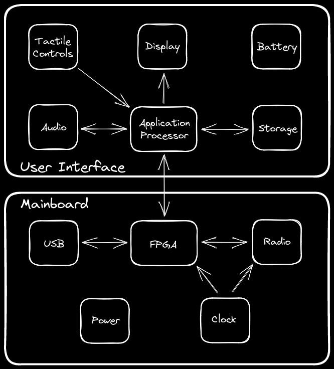
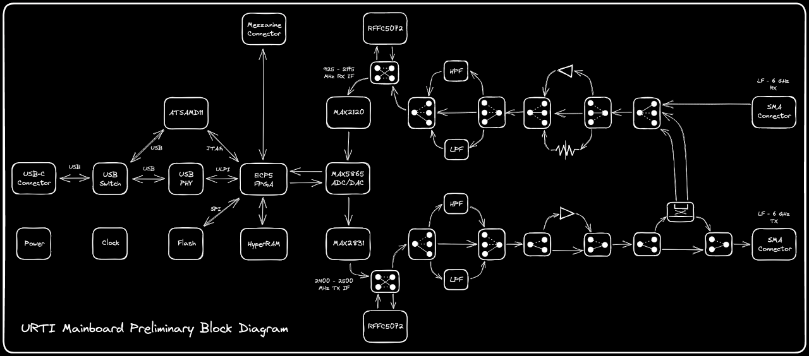
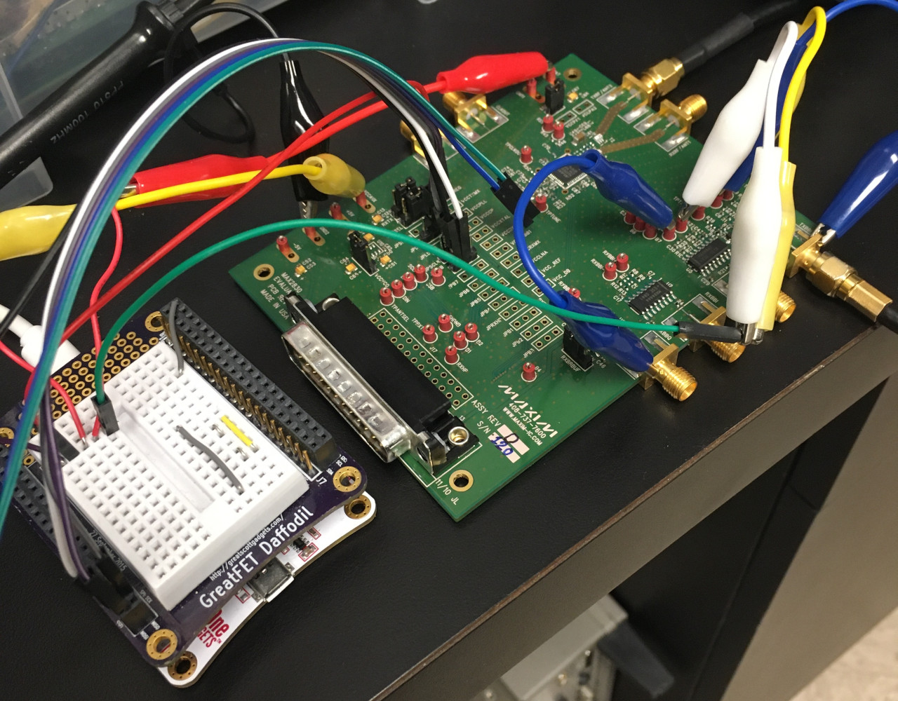
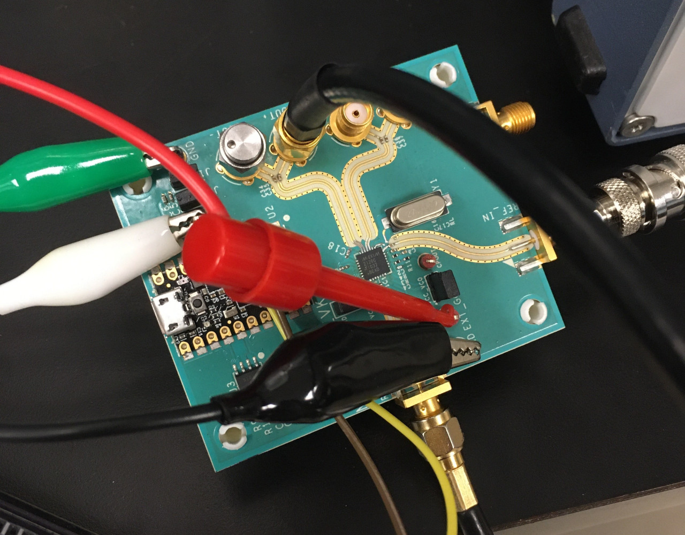

# 2023-05-25 URTI Progress Report

## Phase One Completion

This report describes the completion of phase one of the [Universal Radio Test Instrument (URTI)](https://greatscottgadgets.com/urti/) project.

## Phases

The URTI project plan is made up of eight overlapping phases:

1. Mainboard component selection and sub-circuit evaluation
2. Initial mainboard hardware design
3. User interface board component and sub-circuit evaluation
4. Mainboard firmware and gateware development
5. Host software development to enable use of the mainboard as a USB peripheral
6. Final mainboard prototype design
7. User interface board hardware design
8. Handheld user interface firmware development

In phase one, we developed a preliminary architecture, a preliminary mainboard block diagram, and evaluated components and sub-circuits in preparation for the initial mainboard design.

## Architecture

We plan to build URTI as a system comprised of two printed circuit board assemblies: a mainboard, and a user interface board. The mainboard will include the radio section and a USB interface and will be capable of serving as a Software-Defined Radio peripheral with or without the user interface board attached. The user interface board will include tactile, controls, display, application processor, and battery, allowing handheld use of the complete system.

## Mainboard Block Diagram

## Component Evaluation

Several elements of the mainboard required independent development and evaluation prior to incorporation into a complete board design. In some cases, a chip manufacturer’s off-the-shelf evaluation kit met our needs at a reasonable price, but we also designed and assembled small printed circuit boards for evaluation of some components and sub-circuits.

### Digital Components

The digital section of the mainboard will be based on [Cynthion](https://greatscottgadgets.com/cynthion/). Components taken from Cynthion include:

* ECP5 FPGA
* HyperRAM
* SPI flash memory
* microcontroller
* USB transceiver
* USB Type-C connector
* voltage regulators
* push-buttons

Because we are familiar with the performance of these components on Cynthion, further evaluation was not necessary.

### ADC/DAC

The Analog-to-Digital Converters (ADCs) and Digital-to-Analog Converters (DACs) will be provided by MAX5865, a dual-ADC/dual-DAC component. MAX5865 is a higher speed grade of MAX5864, a component used on HackRF One. Because of our familiarity with MAX5864, we did not need to evaluate MAX5865 further.

The ADCs will sample quadrature analog baseband signals for RX. The DACs will produce quadrature analog baseband signals for TX.

A potential drawback of MAX5865 is the limited dynamic range of its 8-bit ADCs and 10-bit DACs. If we decide to upgrade to a part with more dynamic range in the future, [AFE7222](https://www.ti.com/product/AFE7222) is a likely candidate.

### Quadrature Transmitter

We will use [MAX2831](https://www.analog.com/en/products/max2831.html) or [MAX2830](https://www.analog.com/en/products/max2830.html) to convert quadrature analog baseband signals to an Intermediate Frequency (IF) between 2.4 GHz and 2.5 GHz for transmission. MAX2831 and MAX2830 are both very similar to MAX2837 used on HackRF One, but we chose to test the components individually.

MAX2831 and MAX2830 are half-duplex transceivers. We will use them only for their transmit function. They each include a quadrature upconverter, a frequency synthesizer, baseband filters, and gain.

We used [MAX2830EVKIT](https://www.analog.com/en/design-center/evaluation-hardware-and-software/evaluation-boards-kits/max2830evkit.html), an off-the-shelf evaluation board, to test MAX2830. We controlled the device with a [GreatFET One](https://greatscottgadgets.com/greatfet/one/) and connected the RF ports to an RF signal generator and spectrum analyzer. The MAX2830 performed as expected, but we discovered that it is not possible to turn off the built-in PA. There is a way to adjust the PA gain but no way to shut it off completely.

We observed the following parameters:

* tuning range: 2321 MHz to 2499 MHz
* TX VGA range: 26 dB
* TX PA range (with 3.3 V supply): 29 dB
* maximum output power: 11 dBm (but this was with questionable quadrature input)

We noticed that MAX2830 lacks the SPI output pin that we have used on MAX2837, so the configuration registers are write-only. It has more pins than MAX2837 for GPIO control and monitoring, including a dedicated pin for PLL lock detect.

Because MAX2831 is almost identical to MAX2830, we determined that either component meets our needs. We also evaluated [MAX2832](https://www.analog.com/en/products/max2832.html) but decided to reject it because it lacks the built-in PA.

<figcaption>

*testing MAX2830 with MAX2830EVKIT controlled by a GreatFET One*

</figcaption>

### Quadrature Receiver

We will use [MAX2120](https://www.analog.com/en/products/max2120.html) to convert an IF between 925 MHz and 2175 MHz to quadrature analog baseband. MAX2120 is somewhat similar to MAX2837 used on HackRF One, but it is a receiver, not a transceiver. It includes a quadrature downconverter, a frequency synthesizer, baseband filters, and gain.

We used [MAX2223EVKIT](https://www.analog.com/en/design-center/evaluation-hardware-and-software/evaluation-boards-kits/max2223evkit.html), an off-the-shelf evaluation board, to test [MAX2223](https://www.analog.com/en/products/max2223.html) and MAX2120. We controlled the device with a GreatFET One and connected the RF ports to an RF signal generator and spectrum analyzer. MAX2223 is similar but lacks baseband filters. We tested MAX2223 first and then replaced the MAX2223 with MAX2120 on the MAX2223EVKIT to test MAX2120.

Both components worked as expected. We observed that they are capable of tuning well outside their advertised ranges. MAX2223 operated from 513 MHz to 2653 MHz while MAX2120 operated from 499 MHz to 2442 MHz.

The MAX2120's external clock input functioned with input all the way up to 60 MHz. Although the data sheet appeared to indicate that it should only work up to 8 MHz, we later reinterpreted the data sheet to mean that it is guaranteed to work up to 30 MHz. (There are several other errors and omissions in the data sheet. For example, the register addresses are all off by one. Testing with the very similar MAX2223 first and reading its data sheet helped us understand the MAX2120 quite a lot.)

The MAX2120 tuning step size must be between 1 and 2 MHz. It must be on the upper end of that range if using a reference clock frequency higher than 30 MHz.

RF gain control worked, but it requires an analog voltage generated by a DAC. There is an additional 15 dB of digitally controlled baseband gain, but it seemed to amplify the noise floor just as much as the signal. We may pick a fixed setting to match the ADC and then adjust only the RF gain.

We tested MAX2223 because it was the component initially installed on the evaluation board, but we plan to use MAX2120 because of its analog baseband filter and low cost.

One drawback of MAX2120 is its 75 ohm interface as they are designed for use as television tuners. We will need to match the 75 ohm input to the IF output of the RX mixer.

<figcaption>

*testing MAX2120 with MAX2223EVKIT controlled by a GreatFET One*

</figcaption>

### Mixers

The transmit and receive paths will each use [RFFC5072](https://www.qorvo.com/products/p/RFFC5072) for conversion between IF and RF. RFFC5072 is a mixer with integrated frequency synthesizer capable of operation over a wide frequency range. Because we are familiar with the part as used on HackRF One, we did not need to evaluate it further.

### SMA Connector and Trace Width

Because of our need to design many small PCBs for testing RF components and sub-circuits throughout the project, it was important to establish a baseline test PCB design featuring RF traces with 50 ohm characteristic impedance and low-loss RF connectors at a reasonable cost. [Initial tests](../../rf-testing/2022-04-06-sma-and-trace-width-test) of PCBs manufactured by [JLCPCB](https://jlcpcb.com/) and [OSH Park](https://oshpark.com/) were moderately successful. [Further refinements](../../rf-testing/2022-04-24-sma-and-trace-width-test) helped us arrive upon a solution that we have used as a basis for several subsequent test boards.

Although the SMA (coaxial RF) connector footprint has performed quite well, [recent tests](../../rf-testing/2023-04-19-sma-jlcpcb-test-board) using Time-Domain Reflectometry (TDR) indicate that the trace impedance still has some room for improvement. We speculate that our PCB stack-up has been adversely impacted by the omission of copper from empty or sparse layers of the PCB design.

### 50:75 Unun

We [explored several designs](../../rf-testing/2022-04-24-unun-test) of a 50:75 ohm unun that could be used to match the impedance of the MAX2120 input. The most intriguing result of our initial testing was the limited success of a lumped element design, but its frequency range required further tuning. After updates made through [careful simulation](../../rf-testing/2022-05-04-unun-modelling), the solution [performed very well](../../rf-testing/2022-05-30-unun-test).

### Clock Generation

While testing clock generators for a recent design change to HackRF One, we determined that the phase noise of CDEL925 and 5L1503 are too high for use in URTI. Si5351 (used in HackRF One) has lower phase noise and would be acceptable, but it may not be necessary to introduce even that much phase noise.

HackRF One supports arbitrary sample rates by producing the sample clock with the very flexible Si5351. In contrast, URTI will be able to perform resampling in its FPGA, making it possible to use a fixed sample rate for the ADC and DAC.

We plan to generate a single 40 MHz clock signal that is used as the ADC/DAC sample clock and also as a reference clock for each of the RF synthesizers. The mixers (RFFC5072) and quadrature transmitters (MAX2830 and MAX2831) support a 40 MHz reference clock directly. The quadrature receiver (MAX2120) can accept a 20 MHz reference clock which we will generate by dividing the sample clock by two with a flip-flop.

In the initial mainboard prototype we plan to use a single 40 MHz temperature-compensated crystal oscillator (TCXO). In the final mainboard design we will likely use a voltage-controlled crystal oscillator (VCXO) capable of being disciplined by an external clock input.

### RF Limiter

Although a limiter does not appear in the preliminary block diagram, we think that we will want to include one or more to protect RF components in the final mainboard design.

Modern RF ICs of the sort we expect to use in URTI and related designs such as [Amalthea](https://github.com/greatscottgadgets/amalthea-hardware) often specify a maximum input power of 10 dBm to 20 dBm. Unfortunately, off-the-shelf RF limiter components and most [traditional designs](https://www.skyworksinc.com/-/media/SkyWorks/Documents/Products/1-100/200480C.pdf) do not begin to have an affect until the input power reaches at least 10 dBm, often much higher. The very wide operating frequency range and low cost requirements of URTI make this problem even more difficult to solve. While investigating this problem, we discovered solutions proposed by Chin-Leong Lim: 

* Avago Application Note 5438, *Schottky Enhanced PIN Limiter* (no longer available from Broadcom/Avago but can be found elsewhere)
* Avago Application Note 5443, *HSMS-482B PIN and HSMS-282B Schottky Diodes for Wideband PIN Diode Limiters with a Very Low Turn-on Threshold* (no longer available from Broadcom/Avago but can be found elsewhere)
* [Reduce Losses In RF Schottky-PIN Limiter Circuits](https://www.radiolocman.com/review/article.html?di=146897)
* [Low Loss Configuration for Integrated PIN-Schottky Limiters](https://www.microwavejournal.com/articles/22741-low-loss-configuration-for-integrated-pin-schottky-limiters)

Lim's key insight is that a Schottky diode anti-parallel to a PIN diode can be used to significantly reduce the limiting threshold of the PIN diode. Broadcom/Avago produced [ASML-5829](https://www.digikey.ca/en/articles/how-and-why-to-use-pin-diodes-for-rf-switching) and other PIN-Schottky limiters in a single package, but they are now obsolete. A few other PIN-Schottky limiters such as [SKY16602-632LF](https://www.skyworksinc.com/en/Products/Diodes/SKY16602-632LF) are available, but they are expensive for use on URTI.

Another trick used by Lim is the use of the parasitic capacitance and inductance of the limiter diodes as elements in a low-pass filter (which can have a high cutoff frequency when using small diodes). This improves the impedance match in the passband, reducing loss. The earliest reference we found to this technique for RF limiters was in HP/Agilent Application Note 1050, *Low Cost Surface Mount Power Limiters*.

We [tested](../../rf-testing/2022-04-24-limiter-test/) a few PIN-Schottky solutions using discrete diodes and found that the technique is likely suitable for URTI.

## Progress on Overlapping Phases

During phase one we additionally made progress on phases four and eight. Although completion of the later phases is still a long way off, work toward those software development goals in parallel with hardware design tasks will speed completion of software after hardware is available. This approach has allowed us to involve more team members in the project.

Separate from URTI but partly in an effort to provide a platform for URTI developers, we have designed and assembled [Amalthea](https://github.com/greatscottgadgets/amalthea-hardware), a Software-Defined Radio add-on for Cynthion. Amalthea provides both transmit and receive capabilities with the same Cynthion-based FPGA back-end as planned for URTI, using our [LUNA](https://github.com/greatscottgadgets/luna) gateware framework for USB. This platform has allowed us to begin development of a [Digital Signal Processing (DSP) library](https://github.com/mndza/dsp_sandbox) for [Amaranth HDL](https://github.com/amaranth-lang/amaranth) and other gateware that will be essential for URTI.

We have started using a Linux-based [handheld game console](https://anbernic.com/products/anbernic-rg552) as an additional development platform because we expect the URTI user interface board to provide similar capabilities and form factor. With a HackRF or Amalthea connected to the game console's USB port, our [waterfall demonstration](https://github.com/mndza/waterfall-demo) allows real-time visualization of radio signals in a handheld form factor similar to the user experience we anticipate for URTI.

## Next Steps

We have evaluated components and sub-circuits that will be required for phase two. This work has allowed us to prepare a preliminary system architecture diagram and a preliminary mainboard block diagram. Further component and sub-circuit evaluation will be necessary (primarily in phase three) in preparation for the user interface board design and for the final mainboard design.

Our next step (phase two) will be the design and assembly of the initial mainboard. We plan to omit the RF components between the mixers (RFFC5072) and SMA connectors in this initial version, quickly making a platform available to software developers. This will also make it possible to test prototype RF sub-circuits as separate boards connected to the initial mainboard's SMA connectors.
