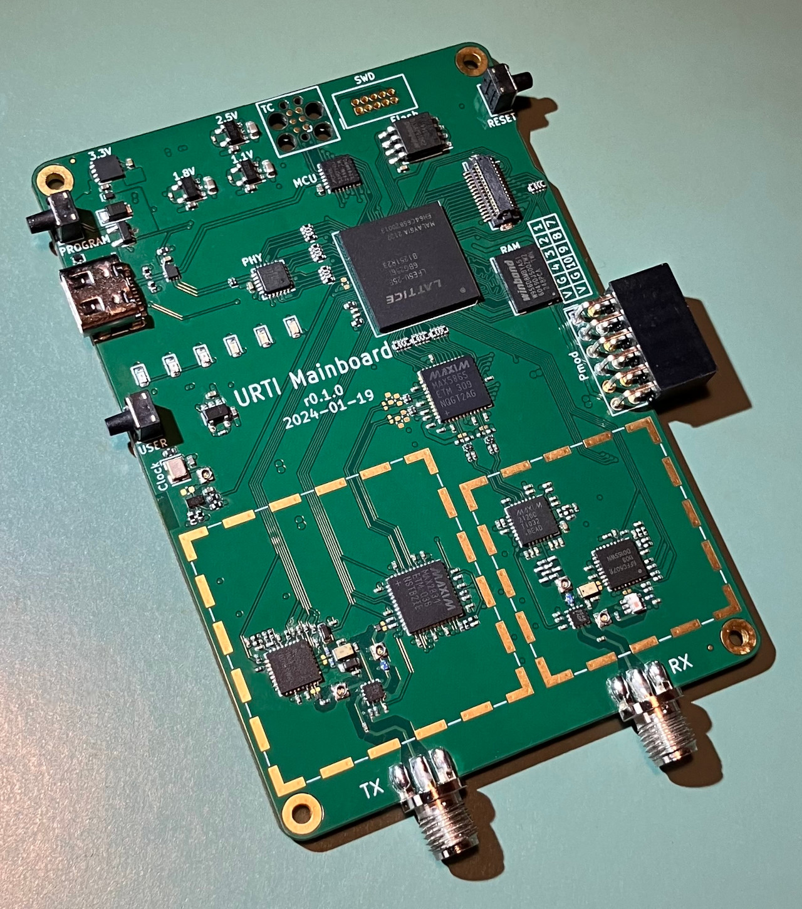

# 2024-02-27 URTI Progress Report

## Phase Two Completion

This report describes the completion of phase two of the [Universal Radio Test Instrument (URTI)](https://greatscottgadgets.com/urti/) project.

## Phases

The URTI project plan is made up of eight overlapping phases:

1. Mainboard component selection and sub-circuit evaluation
2. Initial mainboard hardware design
3. User interface board component and sub-circuit evaluation
4. Mainboard firmware and gateware development
5. Host software development to enable use of the mainboard as a USB peripheral
6. Final mainboard prototype design
7. User interface board hardware design
8. Handheld user interface firmware development

In phase two we completed the initial mainboard design and fabricated prototypes.

## Design and Documentation

We closely followed the plan outlined in the [phase one progress report](../2023-06-02-urti-progress-report), creating a design based on [Cynthion](https://greatscottgadgets.com/cynthion/) with the addition of a full-duplex radio transceiver loosely based on [HackRF One](https://greatscottgadgets.com/hackrf/one/). This initial design omits components such as image reject filters between the mixers and SMA connectors, allowing tests of those components as separate modules connected externally.

[URTI Mainboard release r0.1.0](https://github.com/greatscottgadgets/urti-mainboard/releases/tag/r0.1.0) includes KiCad source files as well as outputs such as a schematic diagram in PDF format.

## Fabrication

Initial fabrication was completed by [JLCPCB](https://jlcpcb.com/). We installed additional components by hand.

## Preliminary Test Results

During the hardware bring-up process we verified all power supplies, power switches, and clock signals. We ported, installed, and tested the [Saturn-V](https://github.com/greatscottgadgets/saturn-v) bootloader and [Apollo](https://github.com/greatscottgadgets/apollo) debugger firmware. Additionally we developed gateware for the FPGA based on [LUNA](https://github.com/greatscottgadgets/luna) which allowed us to communicate with the FPGA over USB.

## Progress on Overlapping Phases

Much of phase four, mainboard firmware and gateware development, was completed before and during mainboard hardware bring-up. Additional work will be required on gateware for the FPGA, especially DSP functions, control of the radio section, and applications. Some progress was made on phases three and five.

## Next Steps

We are now distributing a small number of mainboard prototypes to developers who will continue working on phase four and phase five, host software development to enable use of the mainboard as a USB peripheral. We expect soon to verify full control of the mainboard radio section.

Our next hardware design step is phase three, evaluation and selection of components for the user interface board, already in progress.
