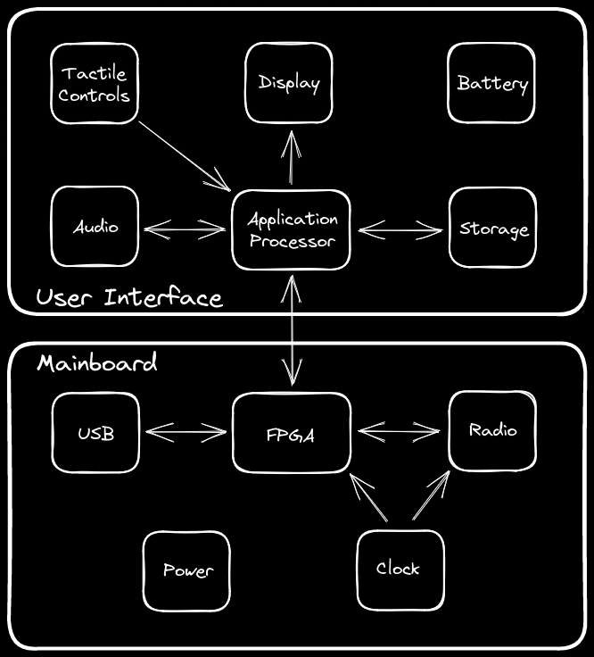

# 2024-06-21 URTI Progress Report

## Phase Three Completion

This report describes the completion of phase three of the [Universal Radio Test Instrument (URTI)](https://greatscottgadgets.com/urti/) project.

## Phases

The URTI project plan is made up of eight overlapping phases:

1. Mainboard component selection and sub-circuit evaluation
2. Initial mainboard hardware design
3. User interface board component and sub-circuit evaluation
4. Mainboard firmware and gateware development
5. Host software development to enable use of the mainboard as a USB peripheral
6. Final mainboard prototype design
7. User interface board hardware design
8. Handheld user interface firmware development

In phase three we evaluated components in preparation for the user interface board design.

## Architecture

As described in the [phase one progress report](../2023-06-02-urti-progress-report), we plan to build URTI as a system comprised of two printed circuit board assemblies: a mainboard and a user interface board.

Recently we have questioned the particular boundary between the mainboard and the user interface board. Although our overall architecture remains unchanged, we now consider the boundary to be an arbitrary choice that may change over time. It may be possible and desirable to implement the handheld platform with a single printed circuit board. Alternatively we may prefer a two-board solution with a different boundary than we originally anticipated.

For now we are focused on designing the handheld platform, and we are willing to adjust the two-board plan however necessary to best achieve our vision for a handheld test instrument. Once an initial design of the handheld platform is completed, we will reassess our plan to produce a USB peripheral platform. While we originally intended the USB peripheral platform and the handheld platform to share a mainboard design, we may instead maintain a separate design for the USB peripheral platform.

## Component Evaluation

In preparation for the initial user interface board design we selected several key components. When going through this process for the RF components of the mainboard, we felt that it was important to test those with which we had no direct experience. In contrast, we feel comfortable selecting components for the user interface board without hands-on testing. We did not find it necessary to design sub-circuits for evaluation.

### Application Processor

The main processor for the handheld platform will be [RZ/G2LC](https://www.renesas.com/rzg2lc), a single-core or dual-core Arm Cortex-A55. With clock speeds of up to 1.2 GHz, we believe that RZ/G2LC is capable of supporting the real-time radio test instrument applications we envision. We will use the dual-core version in the initial design.

A key feature of RZ/G2LC is the [MIPI DSI](https://en.wikipedia.org/wiki/Display_Serial_Interface) display interface. In the past, display panels have featured a variety of digital interfaces, both parallel and serial, but there has been a trend in recent years toward MIPI DSI. This trend is particularly strong for displays of the size we anticipate using in URTI which are medium to large mobile phone displays.

We plan to use the RZ/G2LC's Gigabit Ethernet interface (RGMII) for data transport to and from the mainboard FPGA. The FPGA will process samples at a rate of 40 Msps full-duplex. We expect that most applications will use a lower sample rate between the FPGA and CPU, but RGMII gives us the option of interfacing the CPU at the full sample rate.

RZ/G2LC includes a Graphics Processing Unit (GPU) which we consider to be a requirement. Unlike the GPUs in some competing processors, the [Arm Mali-G31](https://www.arm.com/products/silicon-ip-multimedia/gpu/mali-g31) in RZ/G2LC is supported by an open source driver.

Another benefit of RZ/G2LC over some competing processors is availability in low quantity through distributors. We want individual members of the community to be able to source all of the components of URTI, enabling home-built modifications to our open source design.

### Display

Sourcing a mobile phone display for an open source project is challenging. Very few high resolution displays under 7 inches are carried by the major electronic component distributors. The smaller displays that are carried by these distributors tend to have low resolution, high prices, limited availability, and interfaces other than MIPI DSI. Reasonably priced mobile phone displays are typically available only in quantity and must be sourced directly from the manufacturer or through specialty distributors.

The initial user interface prototype display will be Amelin [AML550A24102-A-CTP](https://www.alibaba.com/product-detail/5-5-inch-TFT-capacitive-touch_1601089384178.html). Unlike most displays in its class, AML550A24102-A-CTP is available from the manufacturer in low quantity through both Alibaba and Amazon, making it suitable for an open source prototype.

### Power Management

We will use [RAA215300](https://www.renesas.com/us/en/products/power-management/multi-channel-power-management-ics-pmics/raa215300-high-performance-9-channel-pmic-supporting-ddr-memory-built-charger-and-rtc) to regulate and manage power supplies on the user interface board. This Power Management IC (PMIC) is specifically designed to support RZ/G2LC and can also power other subsystems. After completion of the initial prototype, we may try a lower cost alternative such as [TPS65219](https://www.ti.com/product/TPS65219).

### Tactile Controls

Although we will likely create custom tactile controls when designing an enclosure for the handheld platform, the initial user interface board design will feature off-the-shelf tactile switches and rotary encoders. Additionally we will experiment with the touch interface of the AML550A24102-A-CTP display.

### Audio Codec

We will use [DA7219](https://www.renesas.com/us/en/products/analog-products/audio-video/audio-codecs/da7219-audio-codec-advanced-accessory-detect) for audio input and output. This codec supports the RZ/G2LC's I2S interface and enables compatibility with a wide variety of headsets.

## Progress on Overlapping Phases

We made further progress on phases four and five, creating mainboard firmware, gateware, and host software sufficient to fully validate the mainboard prototype design. A few small mainboard design errors were uncovered, but these were all possible to work around with bodges.

## Next Steps

Our next steps will be phases six and seven, completion of the final mainboard prototype design and the user interface board design. These phases will overlap significantly while we determine if the mainboard design will be shared between the handheld platform and USB peripheral platform.

We will continue to make progress on phases four and five, enabling use of the mainboard as a general-purpose SDR peripheral and adding to the library of gateware DSP functions that will be important for handheld software applications.
