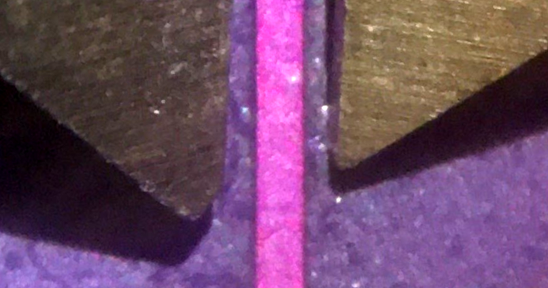
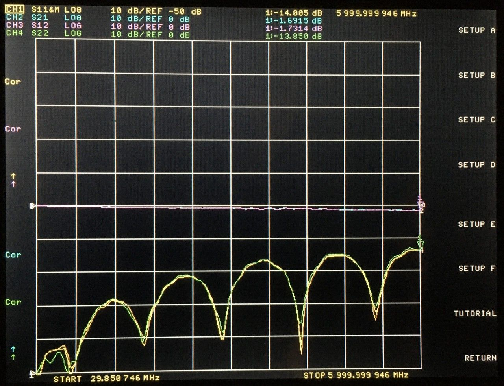
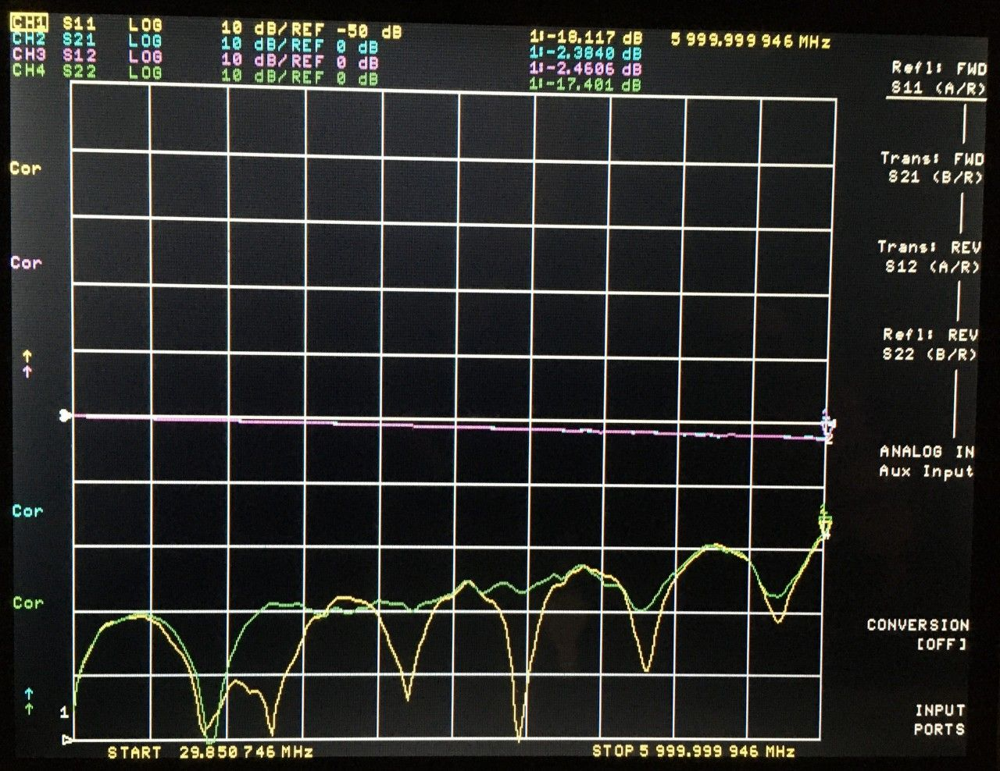
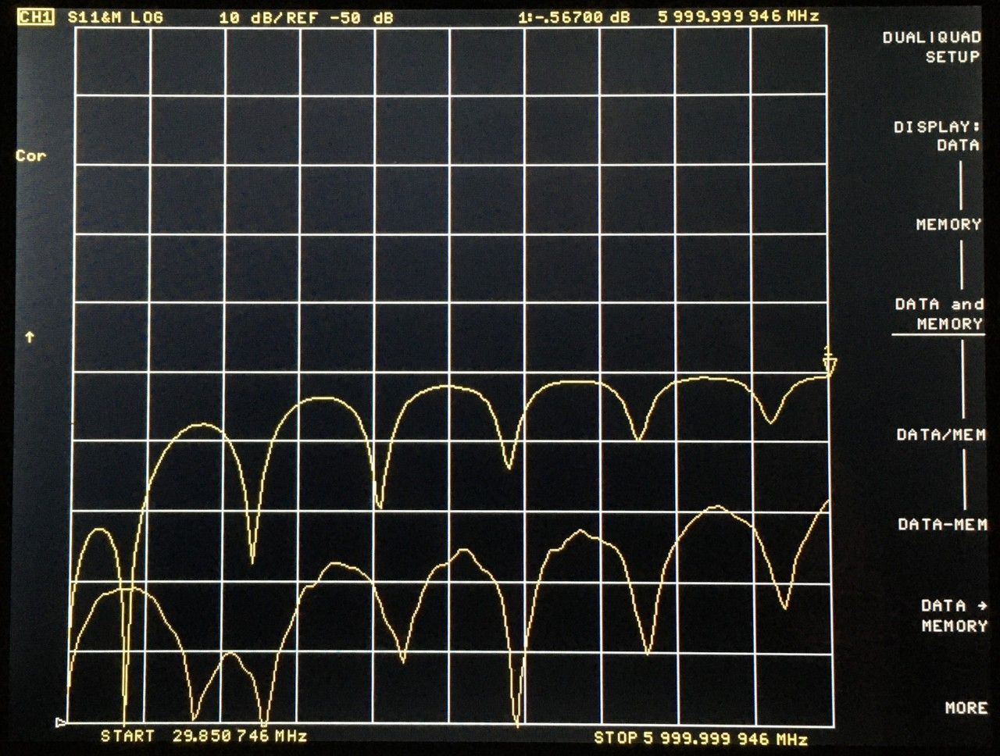
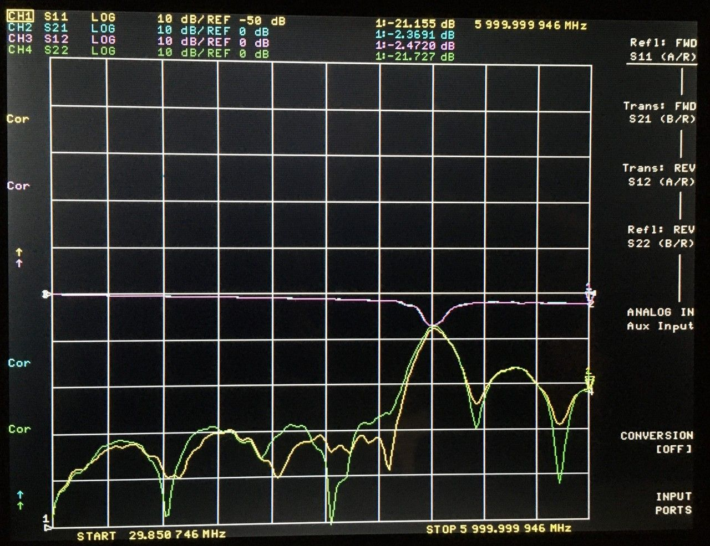

# 2022-04-06 SMA Connector Footprint and Trace Width Test Report

## Purpose

Evaluate performance of various trace widths and SMA connector footprints on PCBs from OSH Park and JLCPCB. Determine a preferred service, trace width, and footprint for future low cost RF test PCBs.

The PCBs designs are here (commit 1fc9360 used for manufacturing): https://github.com/greatscottgadgets/misc/tree/master/evaluation-boards/trace-width

 
## OSH Park Trace Width

Online impedance calculators in the past have suggested 11 to 13 mil microstrip width for 50 ohm characteristic impedance, but calculations and measurements from others have indicated that this is too narrow:

* Darrell Harmon suggested .41 mm (16.1 mil) after measurement: [OSHPark 4 Layer PCB Measurements](https://harmoninstruments.com/posts/oshpark_4l.html)
* Henrik Forstén's measurements yielded similar results: [TRL measurements with homemade VNA and open source software](https://hforsten.com/trl-measurements-with-homemade-vna-and-open-source-software.html)

Henrik wanted .34 mm traces, but they were overetched to .27 mm. Adding that .07 mm overetching to .34 mm equals the .41 mm that Darrell found.

I tested .33 mm to .45 mm trace widths in .02 mm steps and had lowest S11 (0 to 6 GHz) with .33 mm (.35 mm was a close second). It appears that the optimal trace width for 50 ohm characteristic impedance may be narrower than .33 mm (the narrowest I tested).

Inspection with calipers showed that the actual trace width for a nominal .41 mm trace on my test board was approximately .42 mm, not narrower as expected:

<figcaption>

*.41 mm trace with calipers set to 1.00 mm*

</figcaption>

Maybe OSH Park doesn't overetch like they used to, or maybe they are just inconsistent (OSH Park uses multiple fabs and doesn't offer controlled impedance).

## OSH Park SMA Connector Footprint

My baseline footprint had a 3.7x2.6 mm ground plane cutout based on Henrik's CST simulation for the Linx Technologies CONSMA003.062: [6 GHz frequency modulated radar](https://hforsten.com/6-ghz-frequency-modulated-radar.html)

I tested with CONSMA003.062-G (with gold plating).

Additionally I tested cutouts of 3.5x2.4 mm, 3.9x3.0 mm, 4.1x3.6 mm (the full area between ground pads), 4.1x3.6 mm with an additional ground plane on layer 4, and no cutout.

The best performer (lowest S11) was the footprint with 3.9x3.0 mm cutout, but the results may have been compromised by the suboptimal trace width (.41 mm for the footprint tests).

The overall best performer on the PCB was not one of the footprint tests but was the .33 mm trace width test (with 3.7x2.6 mm cutout):

<figcaption>

*OSH Park best performer: .33 mm trace width test with 3.7x2.6 mm cutout*

</figcaption>

## JLCPCB Trace Width

JLCPCB offers four layer boards with two stack-ups: JLC7628 and JLC2313. JLC2313 (used for LUNA) is lower impedance. Their online impedance calculator recommends against JLC2313 for 75 ohm characteristic impedance (which we are likely to need on future designs), so I went with JLC7628 which is roughly comparable to OSH Park's stack-up.

JLCPCB does not provide impedance test coupons or a test report with their basic service, so we are skeptical that they are actually impedance controlled, but I ordered the PCBs with "Impedance: Yes" selected ("We offer high precision Controlled Impedance PCB at no extra charge").

The JLC7628 impedance calculator suggests 11.55 mil for 50 ohm characteristic impedance. I tested trace widths in 1 mil increments from 8.55 mil to 14.55 mil. The lowest S11 (0 to 6 GHz) was with 11.55 mil as suggested by the calculator.

## JLCPCB SMA Connector Footprint

I tested the same connector footprints tested for OSH Park and found that the best performer (lowest S11) was the footprint with a 4.1x3.6 mm ground plane cutout (the full area between ground pads).

<figcaption>

*JLCPCB best performer: 4.1x3.6 mm cutout test with 11.55 mil trace width*

</figcaption>

The performance improvement of a ground plane cutout vs. no cutout was considerable, with the JLCPCB test board providing the most extreme example:

<figcaption>

*JLCPCB 4.1x3.6 mm cutout vs. no cutout*

</figcaption>

Also notable was the 6 GHz performance of the footprint with 4.1x3.6 mm cutout and added ground plane on layer 4. If I hadn't created a resonance at 4.2 GHz, this may have been the best performer:

<figcaption>

*JLCPCB 4.1x3.6 mm cutout with additional ground plane on layer 4*

</figcaption>

## Conclusion

The overall best performer was the JLCPCB "11.55 mil, 4.1x3.6 cutout". Refinements are likely possible, but it provides a solid base upon which RF circuits may be tested. JLCPCB may actually be providing the claimed impedance control.

The lower loss (S21) of the OSH Park board at high frequencies is intriguing, but further testing is required to find a suitable trace width and SMA connector footprint for OSH Park.

## Additional Notes

* Martin Ling has a footprint design based on Sonnet simulation, but it is for a different SMA connector, for CPWG rather than microstrip, and was not originally simulated up to 6 GHz.

* Because I was impatient and because we have a lot of vertical SMA connectors, I first tested the OSH Park PCB with vertical connectors before receiving the intended end-launch connectors. The overall results were fairly good and similar to the later results up to 1.5 GHz but degraded from 1.5 GHz to 6 GHz.
