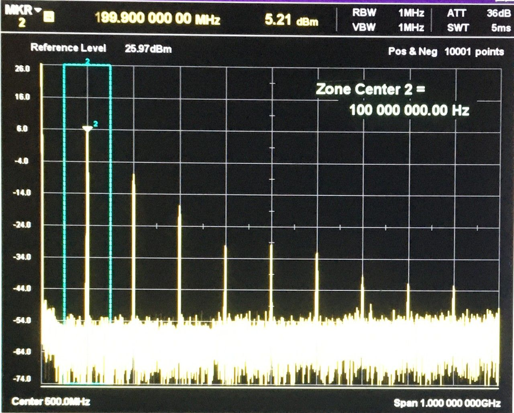
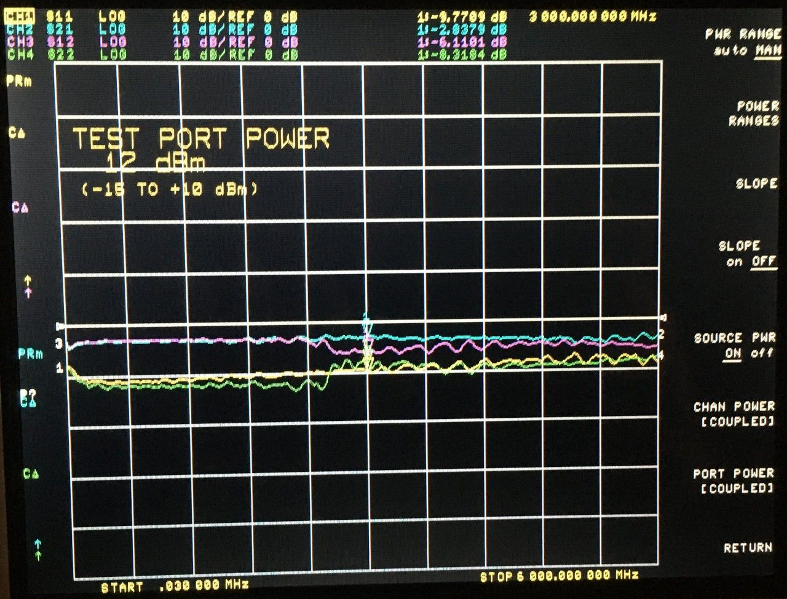

# 2022-04-24 Limiter Test Report

## Purpose

Evaluate performance of various RF limiter circuits intended to protect LNAs or other sensitive RF components up to 6 GHz.

The PCBs were manufactured by JLCPCB. The design is here (commit a5ccc65 used for manufacturing): https://github.com/greatscottgadgets/misc/tree/master/evaluation-boards/limiters

 
## BAR9002ELSE6327XTSA1/BAT2402LSE6327XTSA1

The circuit under test was a PIN-Schottky limiter using 0201 diodes (D7 and D8) from Infineon. I initially assembled the circuit with a solder bridge in place of the series inductor.

<figcaption>

*PIN-Schottky limiter without inductor, 0 dBm input*

</figcaption>

The insertion loss at 0 dBm was quite good, and S11 was fair. I added the 1.0 nH inductor in an effort to form a low-pass filter using the parasitic capacitance of the diodes. This improved S11 at 3 GHz by about 6 dB, although perhaps the filter could be tuned to have a higher cutoff frequency to improve performance at 6 GHz.

<figcaption>

*PIN-Schottky limiter with 1.0 nH series inductor, 0 dBm input*

</figcaption>

<figcaption>

*PIN-Schottky limiter with 1.0 nH series inductor, 0 dBm input*

</figcaption>

I found the 1 dB compression point at 8 dBm input power.

<figcaption>

*PIN-Schottky limiter with 1.0 nH series inductor, 8 dBm input*

</figcaption>

At 12 dBm (the maximum source power of the VNA) there was 3.6 dB of compression at 3 GHz. The compression (S21) was fairly flat across 6 GHz.

<figcaption>

*PIN-Schottky limiter with 1.0 nH series inductor, 12 dBm input*

</figcaption>

I used a signal generator and spectrum analyzer to observe harmonics produced by the limiter.

<figcaption>

*PIN-Schottky limiter with 1.0 nH series inductor, 12 dBm input*

</figcaption>

For some reason this setup indicated 6.2 dB compression (ignoring harmonics) with 12 dBm input rather than the 3.6 dB compression indicated by the VNA, although I did not measure at the same frequency.

This setup allowed me to increase the input power to 16 dBm. I observed 10.1 dB compression at 100 MHz (ignoring harmonics) with 16 dBm input power.

<figcaption>

*PIN-Schottky limiter with 1.0 nH series inductor, 16 dBm input*

</figcaption>

## BAR6302LE6327XTMA1/JDH2S02FSTPL3

The circuit under test was another PIN-Schottky limiter with 0402 PIN diode and 0201 Schottky (D10 and D11). I assembled the circuit with a solder bridge in place of the series inductor.

<figcaption>

*PIN-Schottky limiter without RF choke, 0 dBm input*

</figcaption>

I observed 3.5 dB compression at 3 GHz with 12 dBm input power.

<figcaption>

*PIN-Schottky limiter without RF choke, 12 dBm input*
</figcaption>

I tried adding an RF choke (L11) in series with the Schottky and cut the Schottky's direct GND trace in an effort to stop the Schottky's capacitance from affecting insertion loss. Unfortunately this only improved S21 by 1.7 dB while having a negative effect on compression.

<figcaption>

*PIN-Schottky limiter with RF choke, 0 dBm input*

</figcaption>

I observed 1.6 dB compression at 3 GHz with 12 dBm input power with the RF choke in place.

<figcaption>

*PIN-Schottky limiter with RF choke, 12 dBm input*

</figcaption>

Further testing may be required to determine why this solution had less compression than the BAR9002ELSE6327XTSA1/BAT2402LSE6327XTSA1 solution. I had hoped that the shorter charge carrier lifetime of BAR6302LE6327XTMA1 would result in greater compression, but the Schottky may make that characteristic less relevant.

## JDH2S02SL,L3F/JDH2S02FSTPL3

Intending to test another PIN-Schottky solution, I accidentally assembled a Schottky-Schottky limiter and decided to test it.

<figcaption>

*Schottky-Schottky limiter without inductor, 0 dBm input*

</figcaption>

This solution achieved less than 1 dB compression at 3 GHz with 12 dBm input power.

<figcaption>

*Schottky-Schottky limiter without inductor, 12 dBm input*

</figcaption>

## BAR6402ELE6327XTMA1/JDH2S02FSTPL3

The circuit under test was a PIN-Schottky limiter using 0201 diodes (D5 and D6). I assembled the circuit with a solder bridge in place of the series inductor.

<figcaption>

*PIN-Schottky limiter without inductor, 0 dBm input*

</figcaption>

The solution achieved 2.1 dB compression at 3 GHz with 12 dBm input power.

<figcaption>

*PIN-Schottky limiter without inductor, 12 dBm input*

</figcaption>

## Conclusion

The first PIN-Schottky solution appears to be quite useful. It limits power below 10 dBm with input of 16 dBm and has excellent S11 and S21 with input power levels of 0 dBm or below. Further testing is required to resolve the discrepancy between the two test setups and to test at higher input power.

The trick of constructing an opportunistic filter using the parasitic capacitance of the diodes is quite effective.

The use of an RF choke in series with the Schottky in a PIN-Schottky limiter provided little benefit while reducing the limiter's effectiveness.

There are still many solutions to test, but it looks like a PIN-Schottky limiter will be useful in our designs for protection of LNAs or other components (e.g. AT86RF215 with 10 dBm absolute maximum input power). Additionally it may be possible to use a Schottky detector to trigger control of various components such as RF switches, attenuators, amplifiers, or indicators.
