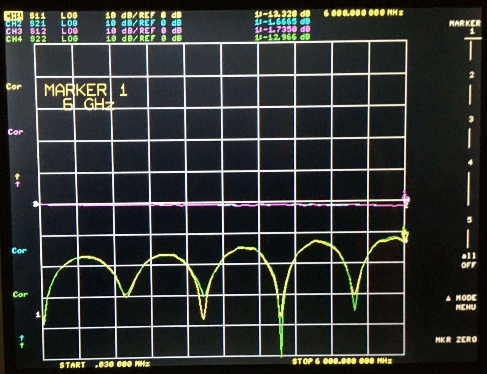
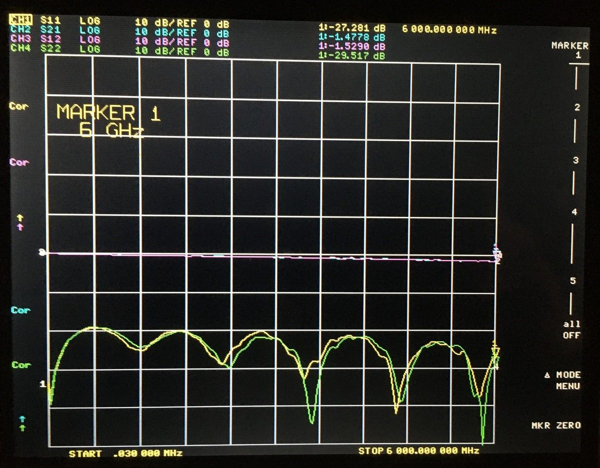

# 2022-04-24 SMA Connector Footprint and Trace Width Test Report

## Purpose

Evaluate performance of various trace widths and SMA connector footprints on PCBs from OSH Park. Determine a preferred trace width and footprint for future low cost RF test PCBs.

The PCB design is here (commit bea227f used for manufacturing): https://github.com/greatscottgadgets/misc/tree/master/evaluation-boards/trace-width

This is a follow-up to: [2022-04-06 SMA Connector Footprint and Trace Width Test Report](../2022-04-06-sma-and-trace-width-test)

 
## OSH Park Trace Width

I tested .29 mm to .35 mm trace widths in .01 mm steps and had lowest S11 (0 to 6 GHz) with .32 mm. The performance of the .32 mm trace was only marginally better than the performance of the .33, .34, and .35 mm traces. A 3.7x2.6 mm cutout was used for the SMA connector footprint in the trace width tests.

<figcaption>

*OSH Park best trace width: .32 mm trace width test with 3.7x2.6 mm cutout*

</figcaption>

While the high frequency results were comparable to the [previous .33 mm trace width results](../2022-04-06-sma-and-trace-width-test), the low frequency performance was worse for unknown reasons. A repeat test of the older PCB reproduced the low frequency discrepancy.

Measurement of the .32 mm trace with calipers indicated that the actual trace width was approximately .27 mm. The board appears to be overetched whereas the previous OSH Park board was not.

<figcaption>

*.32 mm trace with calipers set to 1.00 mm*

</figcaption>

## OSH Park SMA Connector Footprint

I tested the same footprint variations as in the [previous test](../2022-04-06-sma-and-trace-width-test) but this time with .33 mm traces. The only footprint modification was to the footprint with 4.1x3.6 mm cutout (the full area between ground pads) with an additional ground plane on layer 4. While the layer 4 ground plane in the previous test extended a bit beyond the area under the footprint, this time I reduced it to cover only the area between the ground pads.

The best performer (lowest S11) was the footprint with 4.1x3.6 mm cutout and additional ground plane on layer 4.

<figcaption>

*OSH Park best footprint: 4.1x3.6 mm cutout with additional ground plane on layer 4*

</figcaption>

It seems that reducing the size of the layer 4 ground plane was effective in eliminating the 4.2 GHz artifact found in the previous test. Although the low frequency performance was worse than several of the [previous tests](../2022-04-06-sma-and-trace-width-test), it is acceptable, and the high frequency performance was better than any of the previous tests.

## Conclusion

The modification to the layer 4 ground plane resulted in what appears to be the best overall SMA connector footprint tested to date.

The overetching was disappointing after the precision of the trace widths observed in the previous OSH Park PCB. This may have been the cause of the worse low frequency performance.

Considering that JLCPCB 4-layer boards are less expensive, take about the same amount of time from order to delivery, and appear (so far) to be actually impedance controlled, I believe that the best option going forward is to use JLCPCB but to add the layer 4 ground plane (with updated geometry).
