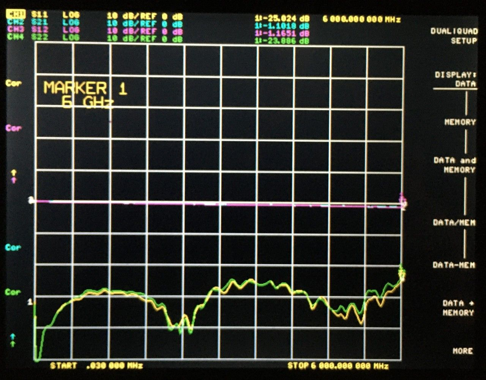
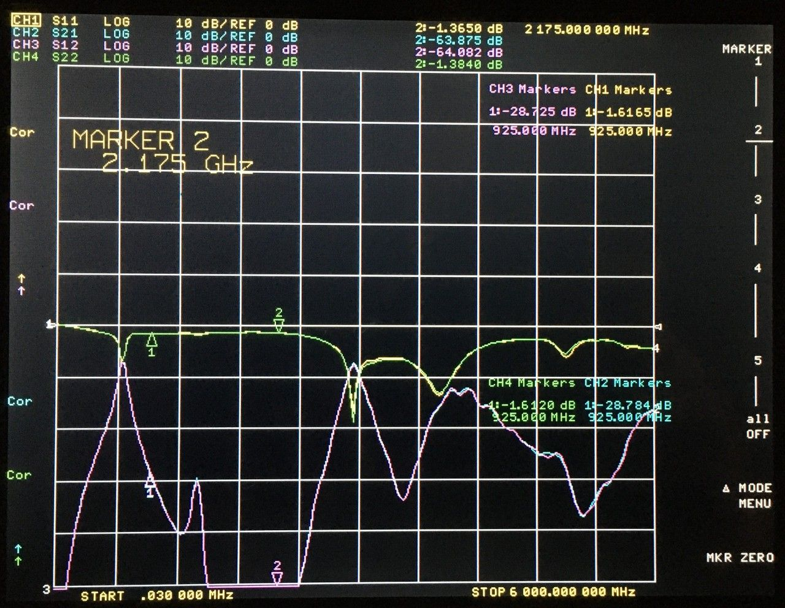
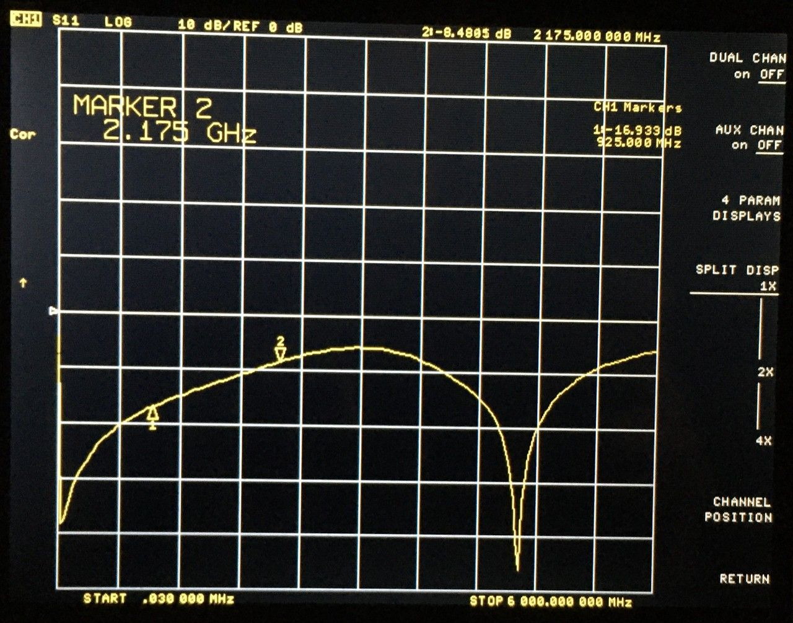
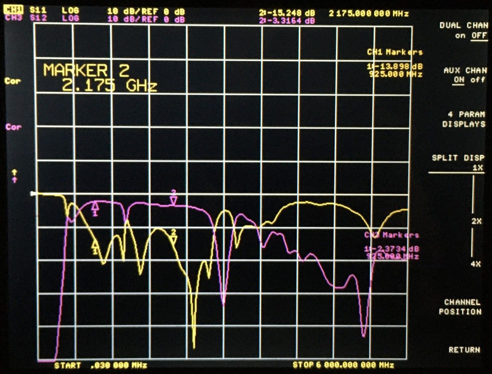
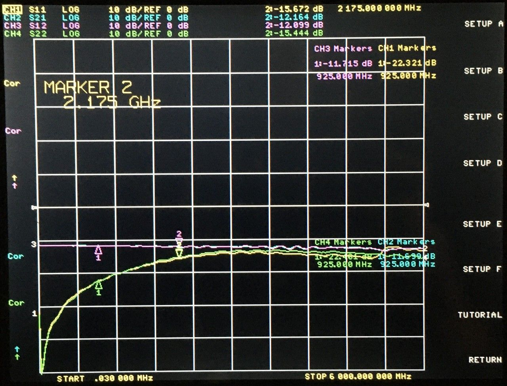
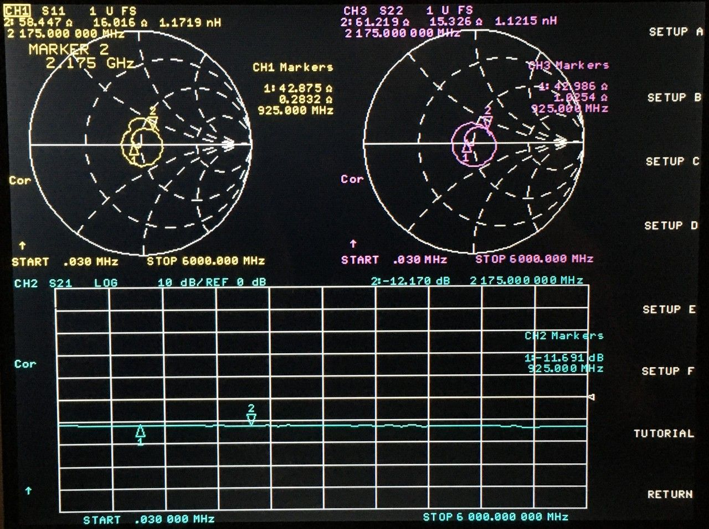
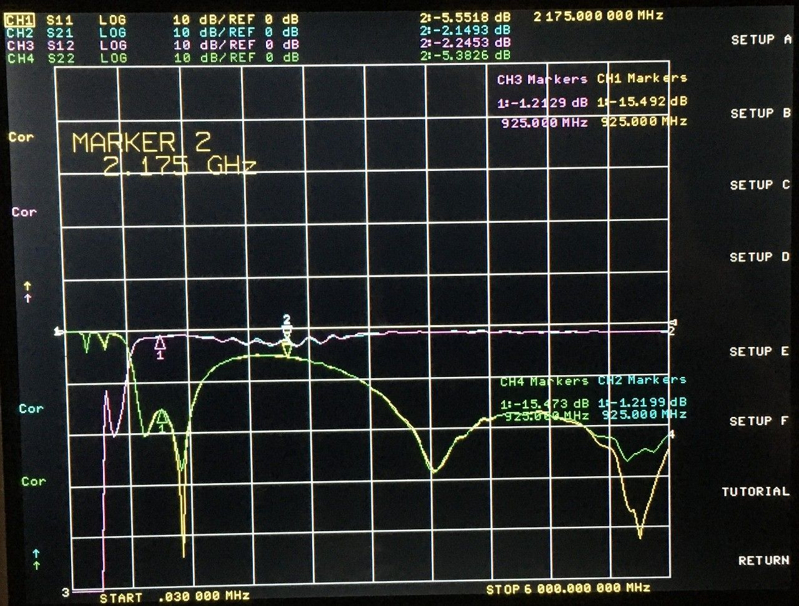
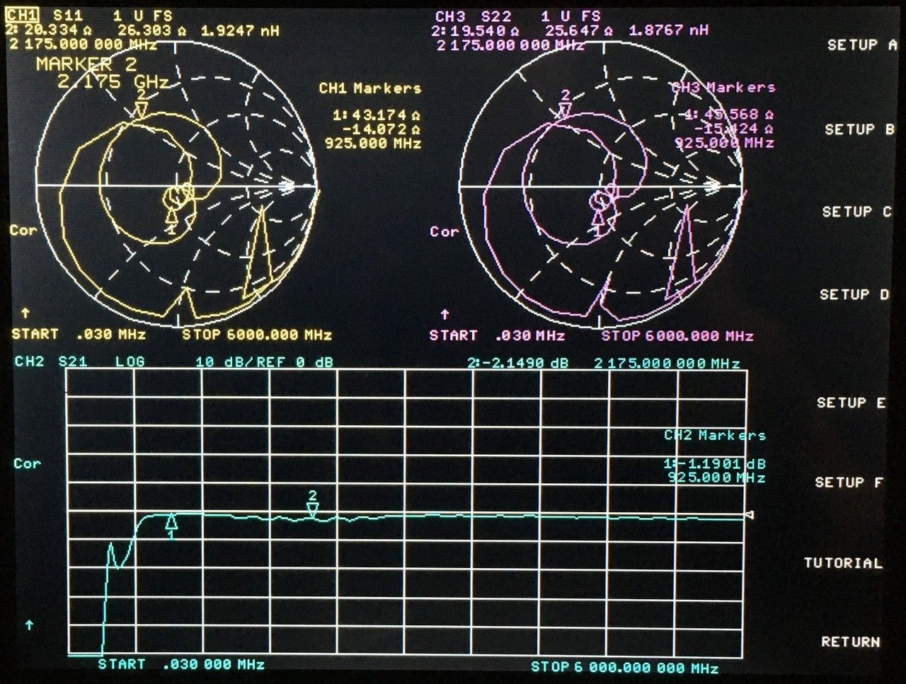
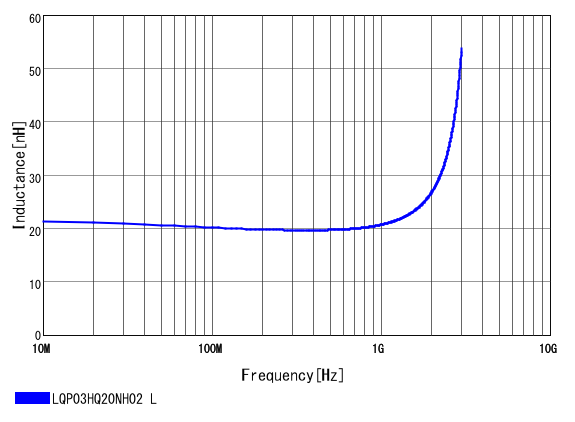

# 2022-04-24 Unun Test Report

## Purpose

Evaluate performance of various 50:75 unun solutions. The intended application is input matching for MAX2120 from 925 MHz to 2175 MHz.

The PCBs were manufactured by JLCPCB. The design is here (commit db4c981 used for manufacturing): https://github.com/greatscottgadgets/misc/tree/master/evaluation-boards/ununs

Although I designed circuits with both 50 ohm and 75 ohm coaxial connectors, I decided to initially test versions that require only 50 ohm connections. These can be populated either with back-to-back ununs or with a single unun terminated by a 75 ohm resistor.

## Trace Width Check

A straight-through trace between two SMA connectors was used to check the PCB properties. The design was based on the JLCPCB "11.55 mil, 4.1x3.6 mm cutout" on: [2022-04-06 SMA Connector Footprint and Trace Width Test Report](../2022-04-06-sma-and-trace-width-test)

The only difference in the new design was that the distance between the SMA connectors was shortened.

<figcaption>

*11.55 mil trace, 4.1x3.6 mm ground plane cutout under SMA connectors*

</figcaption>

## Johanson 1350BL15B0075

The circuit under test consisted of two back-to-back 1350BL15B0075 baluns (TR10 and TR12). These are 50:75 baluns in an experimental unun configuration. The performance was terrible, demonstrating that this configuration is not useful.

<figcaption>

*back-to-back 1350BL15B0075 baluns configured as ununs*

</figcaption>

As an additional check, I tested a single 1350BL15B0075 with a 75 ohm termination resistor and saw similar S11.

## Mini-Circuits TC1.5-1+

As the only off-the-shelf 50:75 unun tested, I expected this one to perform well (though it is expensive). Unfortunately while preparing for assembly I observed that the pinout in the data sheet is incorrect (pins 4 and 6 are swapped). To verify that it does not perform correctly with these pins swapped, I installed TR1 and R2 (75 ohm termination resistor) and measured S11.

<figcaption>

*TC1.5-1+ with incorrect footprint*

</figcaption>

Unsurprisingly the performance was much worse than the performance indicated in the data sheet.

## Back-to-Back Baluns

The circuit under test consisted of two back-to-back ununs. Each unun consisted of a Johanson 1720BL15A0100E (50:100) balun back-to-back with a TDK HHM15112A1 (75:100) balun. The performance was reasonable except for a dip at 1.4 GHz.

<figcaption>

*back-to-back back-to-back baluns*

</figcaption>

## Resistive Matching Pad

The circuit under test consisted of two back-to-back ununs, each a pair of resistors. The circuit performed as expected with 6 dB of loss per unun.

<figcaption>

*back-to-back resistive matching pads*

</figcaption>

<figcaption>

*back-to-back resistive matching pads*

</figcaption>

back-to-back resistive matching pads

## Lumped Element Unun

The circuit under test consisted of two back-to-back ununs, each a lumped element matching network designed by Martin Ling. The circuit performed well from 700 MHz to 1.2 GHz but poorly above 1.3 GHz.

<figcaption>

*back-to-back lumped element ununs*

</figcaption>

<figcaption>

*back-to-back lumped element ununs*

</figcaption>

I suspect that a reason for the poor performance above 1.3 GHz may be that the 0201 inductors I selected have increased inductance at the higher end of our intended frequency range.

I would like to test this matching network again with 0402 or larger inductors.

## Conclusion

If 6 dB loss is deemed acceptable, the resistive matching pad performed best. The back-to-back baluns performed moderately well.

The most intriguing result was the strong performance of the lumped element matching network at lower frequencies. I plan to test variations of this solution with the hope of achieving good results up to 2175 MHz.

Additionally I wish to revise the TC1.5-1+ design to correct the data sheet error.

The most disappointing result was the 1350BL15B0075 balun which did not perform as hoped in an unun configuration.
