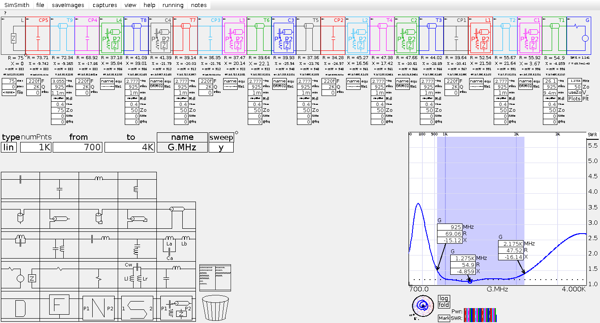

# 2022-05-04 Unun Modelling & Tuning

## Purpose

Develop a 50:75 Ω lumped element unun covering the 925-2175 MHz range, to be used for impedance matching at the MAX2120 input.

The goals of the current work were to:

* Understand the measured results for the initial version as seen in [2022-04-24 Unun Test Report](../2022-04-24-unun-test).

* Develop a model to explain the results and estimate parasitic effects.

* Retune the design, taking account of these effects, to achieve the desired performance.


## Original Design

The initial design of the unun was developed in [SimSmith](http://www.ae6ty.com/smith_charts.html) as shown:


SimSmith file for the original version: [unun-original.ssx](unun-original.ssx)

Components used in the test were:

```
GRM0335C1H3R9BA01D CAP CER 3.9PF 50V C0G/NP0 0201
GRM0335C1H150FA01D CAP CER 15PF 50V C0G/NP0 0201
GRM0335C1H5R1BA01D CAP CER 5.1PF 50V C0G/NP0 0201
GRM0335C1H3R3BA01D CAP CER 3.3PF 50V C0G/NP0 0201
LQP03HQ20NH02D FIXED IND 20NH 250MA 800MOHM SMD
LQP03HQ16NH02D FIXED IND 16NH 250MA 800MOHM SMD
LQP03HQ12NH02D FIXED IND 12NH 300MA 500MOHM SMD
LQP03HQ22NH02D FIXED IND 22NH 250MA 820MOHM SMD
```

Initial testing was of a back-to-back pair of this design for which results can be seen at [2022-04-24 Unun Test Report](../2022-04-24-unun-test). The circuit performed well from 700-1200 MHz but degraded above 1.3GHz.

Subsequent single-port tests with a 75 ohm termination resistor showed broadly consistent results, with a good match just below 925 MHz but little bandwidth:


## Reference Plot

A photo of the Smith chart from the single port tests was used as a reference for modelling. The image was edited in GIMP to correct for perspective, the background made transparent, and the trace hue made red to distinguish from with the blue used in SimSmith. It was then resized to match the SimSmith display and overlaid as a transparent window using the `qiv` viewer with the `-p` option.


Explanatory Model

To help model the circuit more accurately, s-parameter models for all the components used were downloaded from Murata's [SimSurfing](https://ds.murata.co.jp/simsurfing/?lcid=en-us) site. All the component models used in this work are included in this zip file: [unun-components.zip](unun-components.zip)

These component models were then substituted into the SimSmith design, which resulted in a Smith plot with some similarity but only at low frequencies:


Assuming some parasitic capacitances of ~0.25 pF at each node in the layout produced a more recognisable trace, but rotated on the chart relative to the reference plot. A transmission line was then added to the model to account for this phase shift of approximately 38 degrees at 925 MHz. With these corrections, the model started to resemble the measurements up to 2175MHz:


To achieve a closer match, it was necessary to account for the fact that the phase shift is distributed across the layout. The single transmission line was replaced with individual lines between components, with lengths and impedances corresponding to those on the layout. After further adjusting the effective velocity factor of these traces, and the parasitic capacitances of the layout, a very close match to the reference plot was achieved:


These figures are consistent with the layout:

* A couple of tenths of a pF is the expected order of magnitude for layout parasitics at this scale.

* The total phase shift seen corresponds to a transmission line length of 18.4mm on the microstrip geometry used. The distance from the 75 ohm resistor to the board edge was 17.5mm and the VNA calibration plane was at the end launch SMA connector there.

SimSmith file for this model (should be placed in the same directory as the component models): [unun-as-measured.ssx](unun-as-measured.ssx)


## Analytical model

Whilst allowing for great accuracy, a model based on component data files is difficult to use for tuning, because component values can only be adjusted by selecting new data files. To enable easier tuning, the s-parameter models were now replaced with standard SimSmith component models, but with effective values and Q factors adjusted using data from SimSurfing. The resulting model is no longer an exact match, but still exhibits similar behaviour and is easier to experiment with values on:


Component values were then adjusted using this analytical model, with the goal of finding the best match possible using available component values:


After finding what seemed to be the best set of values, an SWR of ~1.2 or below was achieved from 1 to 2 GHz, with slightly worse performance at the band edges and a sweet spot with a near-perfect match occurring at around 1275 MHz.

Note that the values used are very different from the original design: inductors range from 5.6 to 7.5 nH rather than 12 to 22 nH, and capacitors range from 2 to 6.2 pF rather than 3.3 to 15 pF.

Varying the component values in SimSmith suggests that the performance will vary somewhat with component tolerances, but should have an SWR lower than 1.4 even in worst case combinations.

SimSmith files for the analytical model, before tuning: [unun-as-analysed.ssx](unun-as-analysed.ssx)

After tuning: [unun-optimised.ssx](unun-optimised.ssx)


## Revised component selections

Finally, new components were selected, from the same Murata 0201 product lines as the original set, but with the values chosen in the analytical model. The s-parameter models for the new components were downloaded from SimSurfing and substituted into the explanatory model.

As expected given the differences between the models, the result was not an immediate match to that from the analytical model, but the analytical tuning made it possible to start in the right ballpark.

Final tuning was done by adjusting individual component values up or down, by selecting model files with the next available value. Experience from tuning the analytical model was helpful here, because it provided an understanding of which adjustments would have what effect.

The final result shows similar performance to the analytical model, but uses slightly different values:



SimSmith file for this model - should be placed in the same directory as the component models: [unun-redesigned.ssx](unun-redesigned.ssx)


## Conclusion

The performance of the initial design in previous tests can be fully explained by a simulation including:

* Accurate component models based on measured data from the manufacturer.

* Parasitic capacitances to ground for each connected area of copper in the layout.

* Phase shifts caused by the transmission lines between components.

Parameters of the parasitic effects have been determined by fitting to the measured data, giving a very close match. New components have been selected which achieve the target performance when substituted into the explanatory model.

The recommended components are as follows, referenced to the identifiers in the SimSmith models:
```
C1: GRM0335C1H6R2BA01 (6.2 pF)
C2: GRM0335C1H2R5BA01 (2.5 pF)
C3: GRM0335C1H2R5BA01 (2.5 pF)
C4: GRM0335C1H2R0BA01 (2.0 pF)
L1: LQP03HQ6N8H02 (6.8 nH)
L2: LQP03HQ6N2H02 (6.2 nH)
L3: LQP03HQ5N6H02 (5.6 nH)
L4: LQP03HQ7N5H02 (7.5 nH)
```

On the `ununs` test PCB, these identifiers correspond to two footprints each:
```
C1: C8, C12
C2: C7, C11
C3: C6, C10
C4: C5, C9
L1: L8, L12
L2: L7, L11
L3: L6, L10
L4: L5, L9
```
