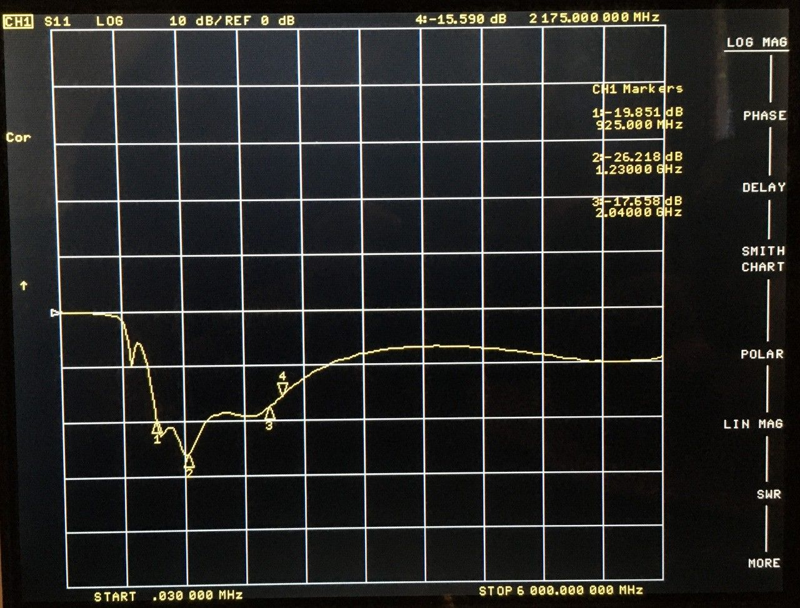
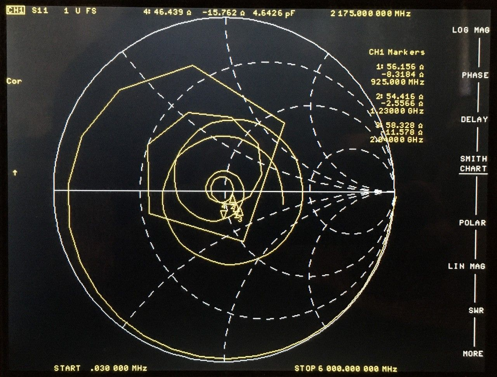
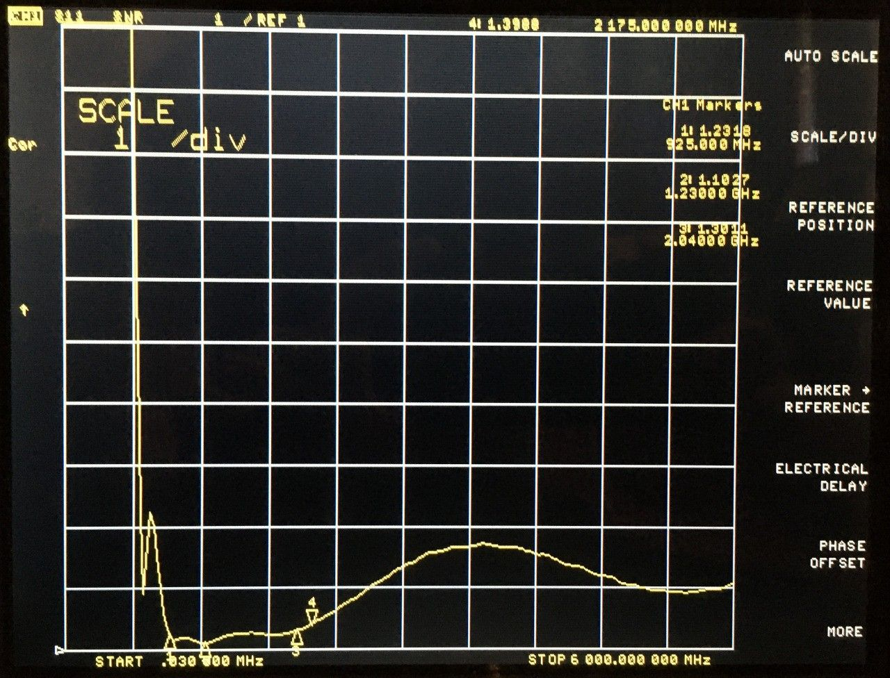
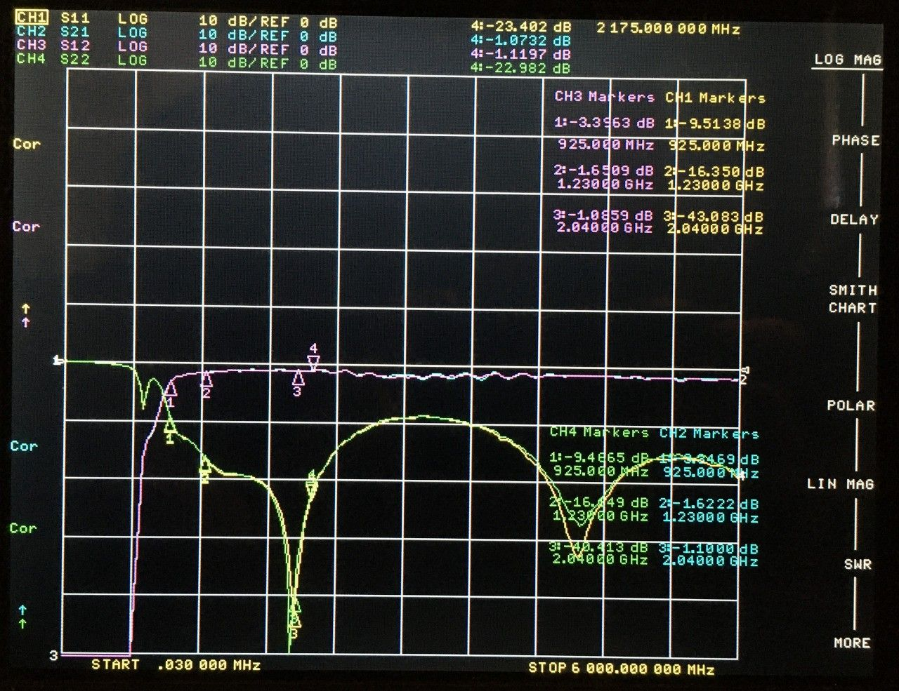
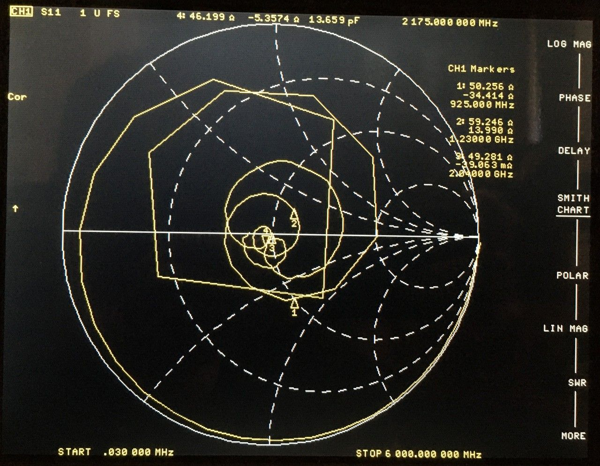
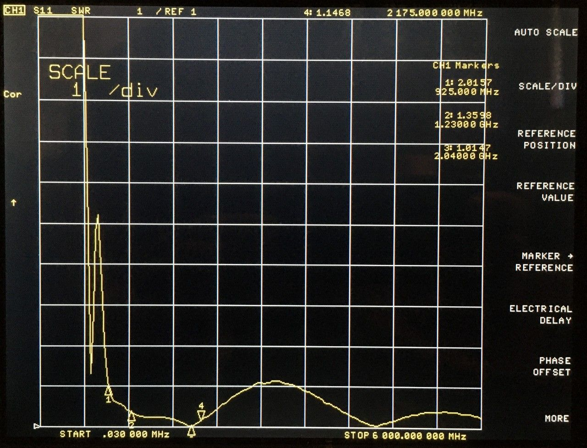

# 2022-05-30 Unun Test Report

## Purpose
Evaluate the performance of a revised lumped element 50:75 unun design: [2022-05-04 Unun Modelling & Tuning](../2022-05-04-unun-modelling) (using components recommended in the Conclusion)

This test was done with the same PCBs made for: [2022-04-24 Unun Test Report](2022-04-24-unun-test)

 
## Terminated

I populated a single unun with a 75 ohm termination resistor to evaluate return loss.

## Back-to-Back

I populated and tested two ununs back-to-back.

 

## Conclusion

The test results closely match the simulation. This proves that a lumped element solution is practical to match 50 ohms to 75 ohms over the frequency range of 925 MHz to 2175 MHz. Some additional refinement may be possible, but I do not believe it would be worth the effort except perhaps to tune performance of a complete pre-production design.

My suspicion that it would be necessary to use 0402 or larger inductors was incorrect.
