# 2023-04-19 SMA connector footprint test board for JLCPCB 7628 stackup

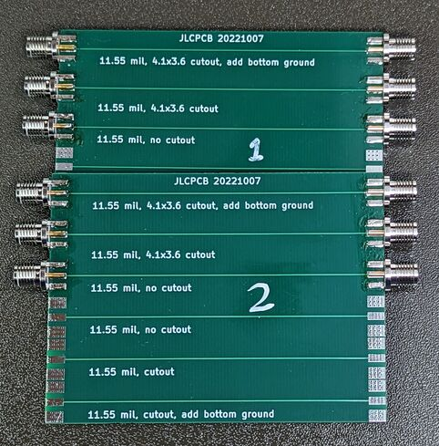

## Purpose

Evaluate performance of various SMA connector footprints on PCBs from JLCPCB. Determine a preferred footprint for future low cost RF test PCBs.

The PCB design is here: https://github.com/greatscottgadgets/misc/blob/9fe274b40c20f9e9bdf20223b6961fbbd1ebdcc6/evaluation-boards/trace-width/sma-jlcpcb.kicad_pcb

## Background

Most low cost SMA connectors have a relatively thick centre conductor, requiring a footprint with a wide pad to mount to. On thin or 4+ layer boards, the relatively wide pad results in a characteristic impedance much lower than 50 ohms for that section of the trace and this impedance discontinuity causes poor performance at high frequencies.

This PCB tests out some footprint variants with cutouts in the ground plane under the centre conductor pad, which aim to bring the impedance back up to 50 ohm.

The following footprints are included for both `Linx CONSMA003.062` and `Molex 732512120` connectors:

 * No cutout, as a baseline.
 * A 4.1x3.6 mm cutout in all layers.
 * A 4.1x3.6 mm cutout, with a ground plane added on the bottom layer.

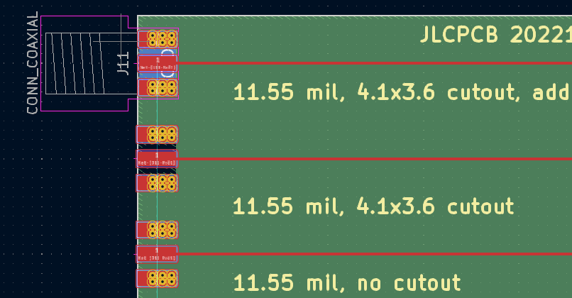

## Linx CONSMA003.062 results

### S-parameters

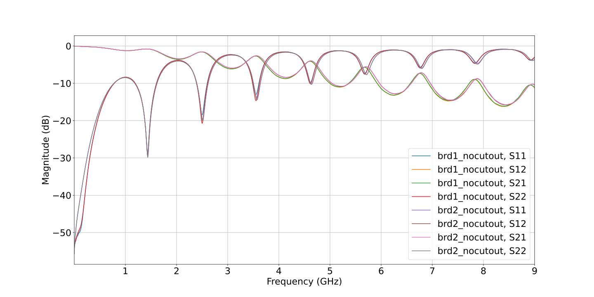
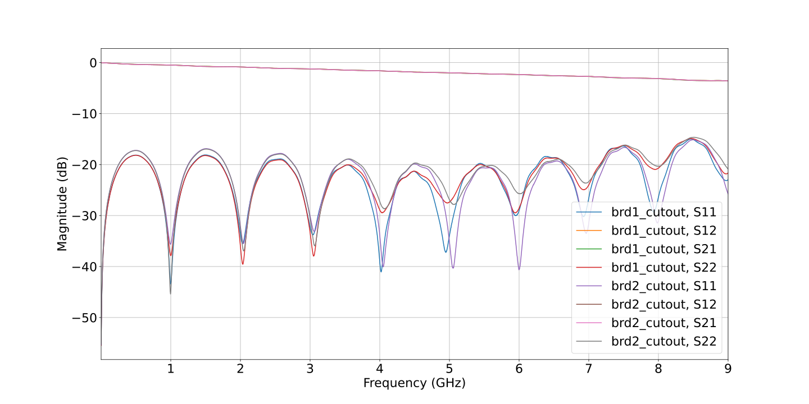
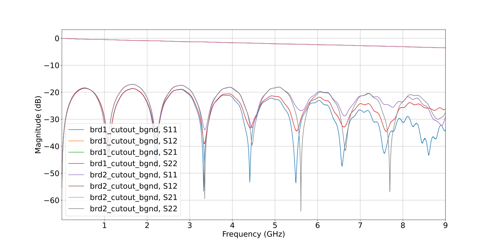

### TDR step response

#### No cutout
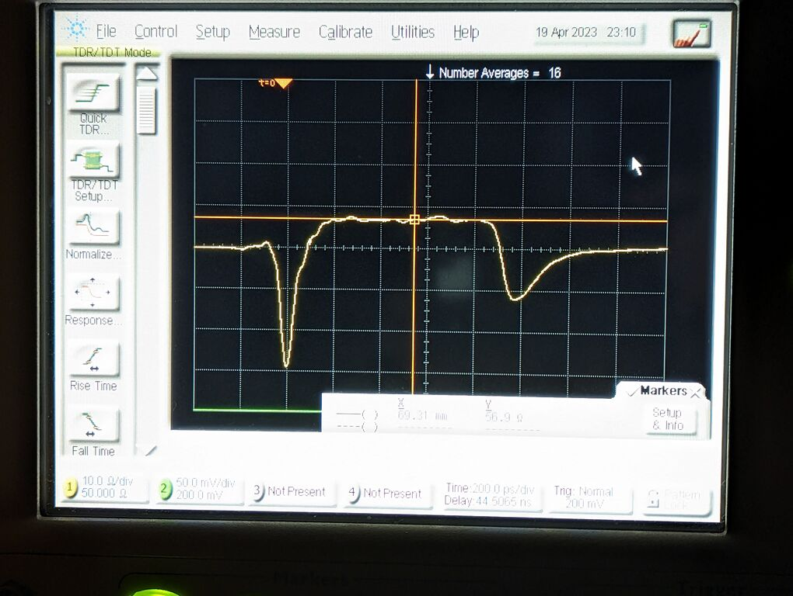
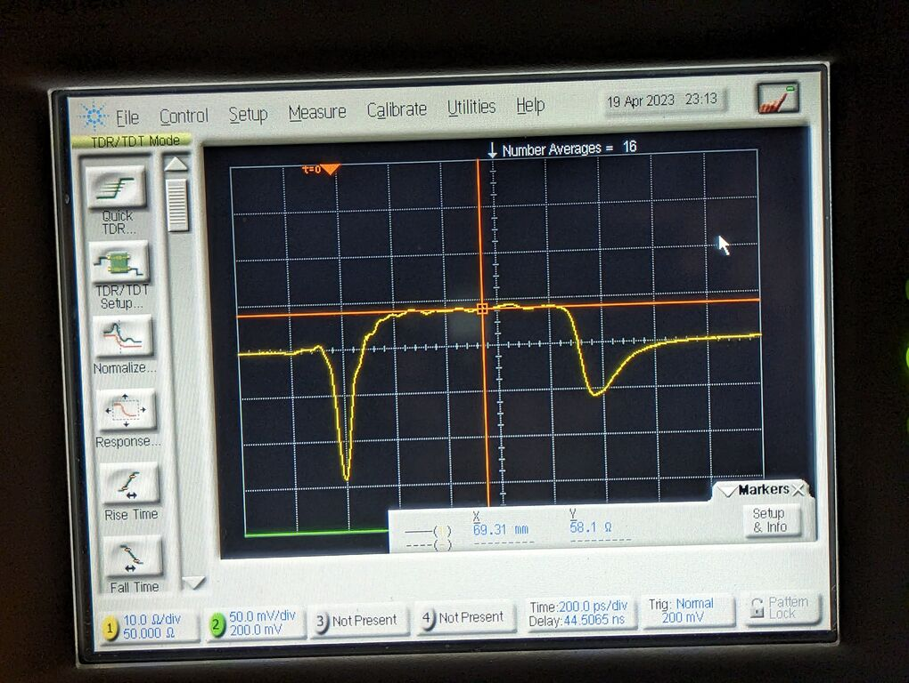

#### With cutout
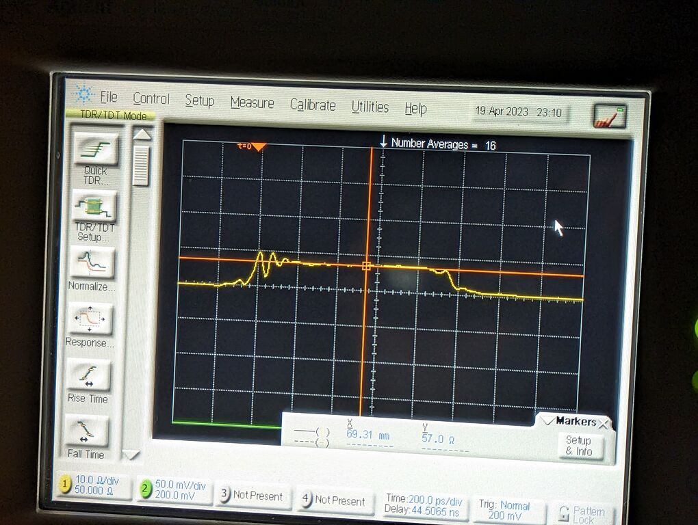
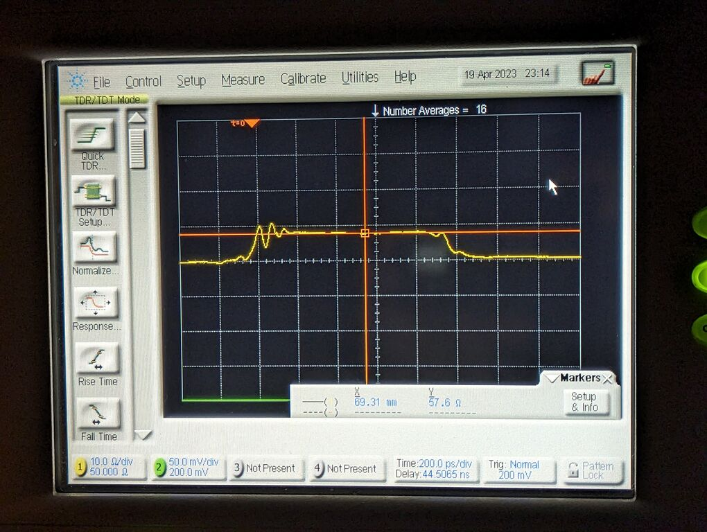

#### With cutout & bottom ground

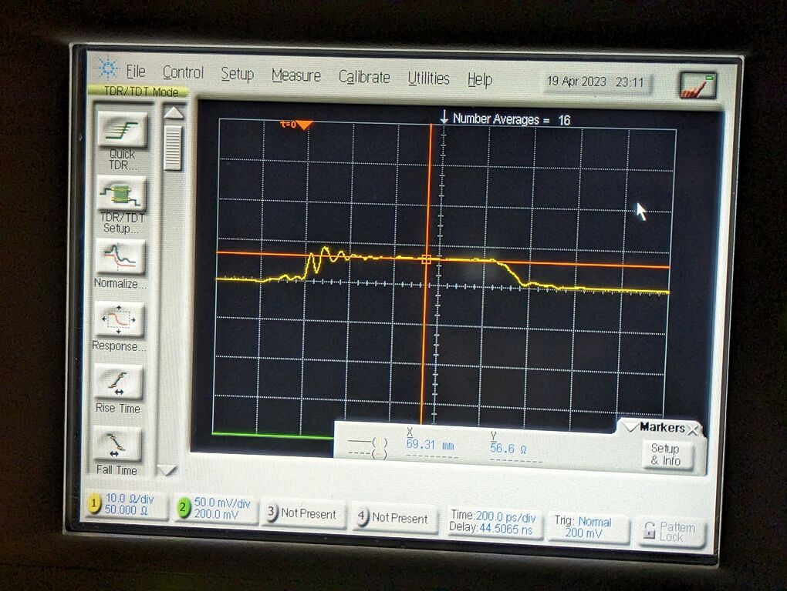
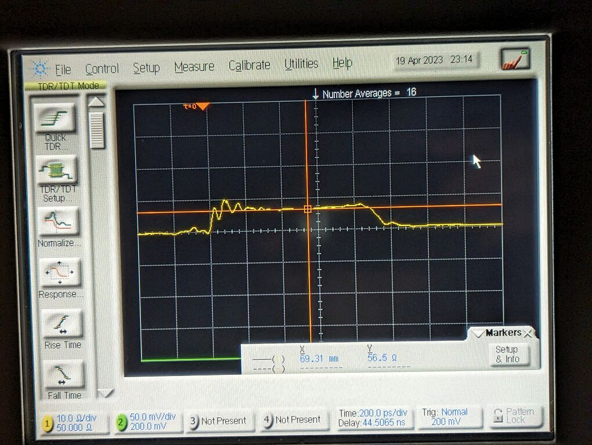

## Molex 732512120 results

tbd
