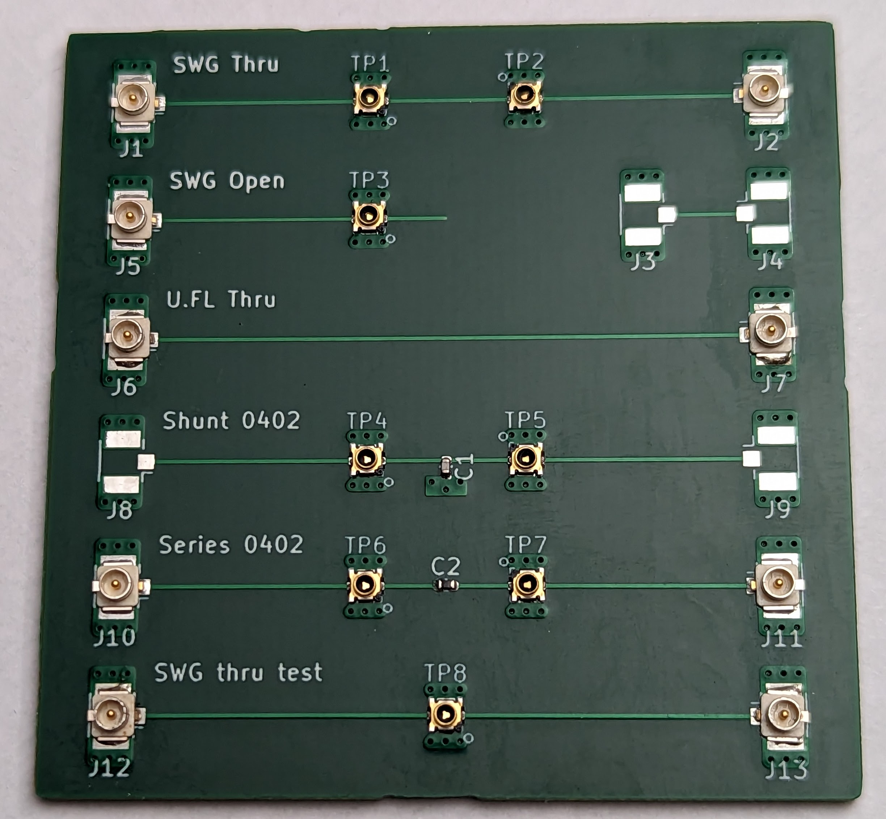
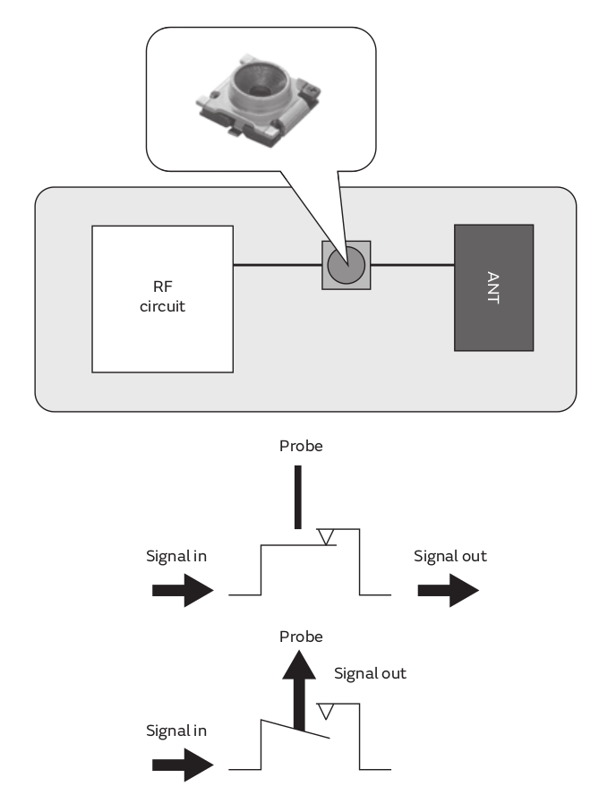
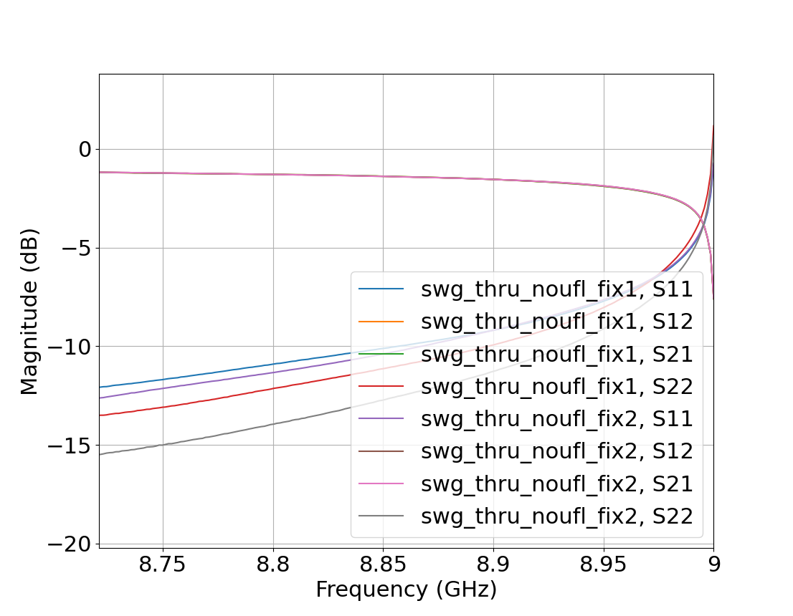
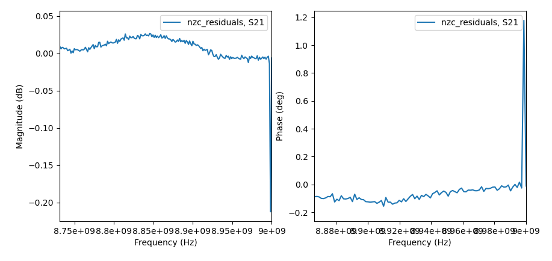
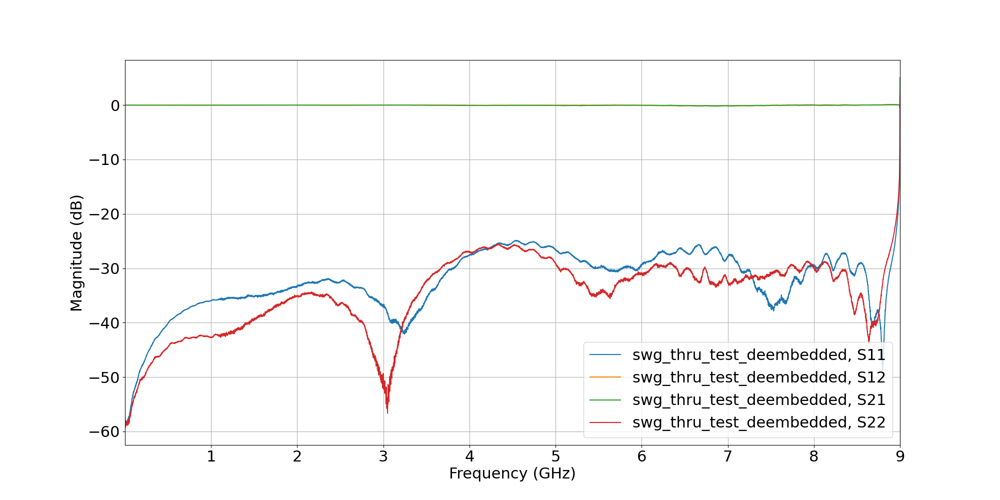
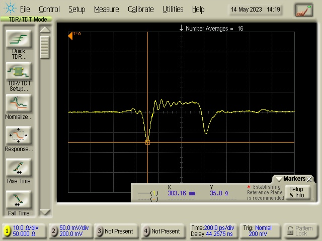
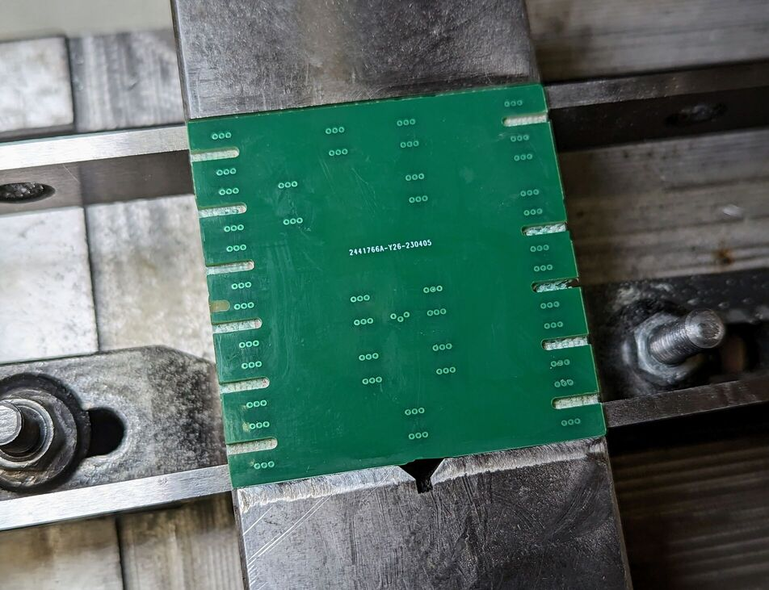
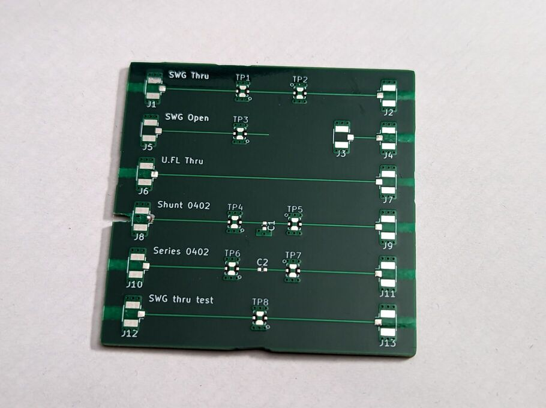
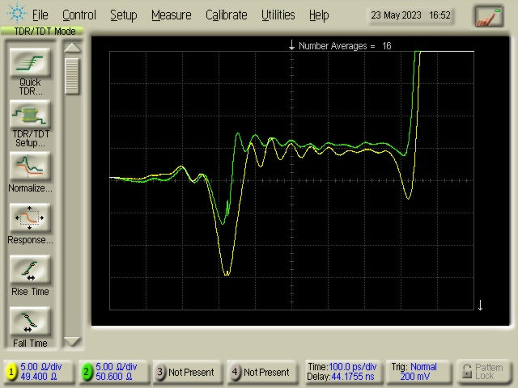

# 2023-05-16 SWG Test Board

## Description

The purpose of this board is to evaluate performance of Murata SWG-series switchable RF test connectors. These connectors can be placed in series with a transmission line and usually act as a through connection. When a probe is attached, the through connection is broken and one side of the tranmission line is connected to the probe.

This makes it easy to reliably test separate blocks of a design, without having to build them as separate modules needing to be cabled together.

The test board includes 2xThru structures designed to be used with the [IEEEP370 de-embedding algorithms](https://scikit-rf.readthedocs.io/en/latest/examples/networktheory/IEEEP370%20Deembedding.html).

## Results

### Importance of 2xThru length

Unfortunately, there is limited advice available on how to design a good 2xThru structure. One piece of advice is to make the structure at least a certain length, depending on the total bandwidth of the S-parameter measurements ([this article from Copper Mountain](https://coppermountaintech.com/eliminating-fixture-effects-from-embedded-measurements/) recommends 2.4" for 9 GHz bandwidth). This is because the de-embedding algorithm uses the time-domain transform to gate each half of the fixture, and the time (and length) resolution is limited by bandwidth.

I thought that this wouldn't be a problem on this test board, because the SWG probes themselves have a long pig-tail and this makes the overall thru length long enough. However, running the algorithm generates fixture S-parameters with an unexpected spike at the end of the frequency range:

A check recommended by the specification is to use the generated fixture S-parameters to de-embed the orignal Thru, and the residual S21 magnitude and phase should be very close to 0, but this check also shows a large spike at the end:

An [issue raised on the scikit-rf repository](https://github.com/scikit-rf/scikit-rf/issues/825) suggests that this can be caused by using a 2xThru where the middle impedance section is too short.

After looking further into the algorithm, I think I understand why this is. For finding S11 of the first fixture, for example, it takes S11 of the Thru and converts it to time domain, giving a plot of impulses against time. It then finds the mid-point, zeroes out the second half of the data, and converts back to frequency domain. If the length of uniform impedance in the middle is too short, then the edges of any impulses can overlap the mid-point and so setting the second half to zero causes a sudden step which shows up as high-frequency content when converted back to the frequency domain.

So, for future fixtures, I think the appropriate advice is to make sure that the 2xThru structure contains a section of uniform impedance in the middle that is at least 2.4" (for 9 GHz, as suggested above), rather than looking at the length of the whole structure.

While the SWG Thru trace is too short to be reliable, the U.FL trace is much closer to the minimum so that has been used below (though it still shows some artifacts at the top end of the frequency range).

### SWG Insertion Loss

By using the `U.FL Thru` trace as a 2xThru structure to de-embed measurement of the `SWG Thru Test` trace, we can measure the effect of placing an SWG connector on the transmission line:

Performance looks very good with insertion loss below 0.2dB out to beyond 6 GHz, so I'm confident that these connectors can be used in future test boards without having any significant impact on the rest of the circuit.

### U.FL footprint

For this board, I used that standard KiCad library footprint for the U.FL connector. However, it has a fairly significant mismatch:

I think this is due to the large signal pad, the wide trace on the bottom of the connector itself, and the proxmity to the ground plane on layer 2. I think it could benefit from a ground cutout similar to previous SMA connector test boards.

#### Update (2023-05-23):

I realised I could try the ground cutout fairly easily by milling slots in the back of the PCB:

This improved things a lot, reducing the mismatch to ~6 ohms, but could still be improved further:

(The yellow trace is the unmodified board, green is the modified board)