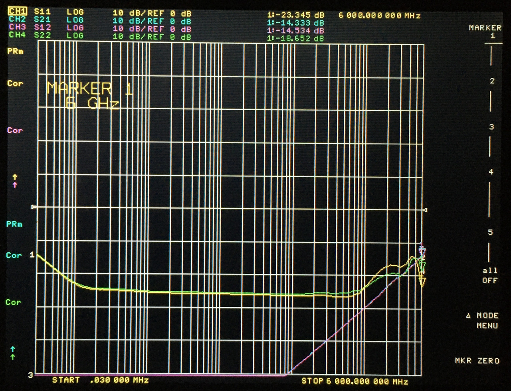

# 2023-05-31 DPDT RF Switch Test

## Purpose

Evaluate the performance of DPDT RF switches. These four-port switches provide two states: straight through or crossover. They are variously described as DPDT or more specifically X-DPDT (indicating crossover).

The PCBs were manufactured by JLCPCB. The design is here (commit ed889b9 used for manufacturing): https://github.com/greatscottgadgets/misc/tree/master/evaluation-boards/rf-switch-dpdt

All capacitors were populated with Samsung CL05A105KA5NQNC. I tested only one pair of ports on each switch. I placed 50 ohm SMA terminators on unused ports and applied 3.3 V control signals.

Components were selected from: [rf-switches-2023-04-09](../../component-notes/rf-switches-2023-04-09.md)

## SKY13411-374LF

[data sheet](https://www.skyworksinc.com/-/media/SkyWorks/Documents/Products/1601-1700/SKY13411_374LF_201665C.pdf)

<figcaption>

*SKY13411 insertion loss*

</figcaption>

<figcaption>

*SKY13411 isolation*

</figcaption>

<figcaption>

*SKY13411 unpowered*

</figcaption>

## SKY13438-374LF

[data sheet](https://www.skyworksinc.com/-/media/SkyWorks/Documents/Products/1801-1900/SKY13438_374LF_201844B.pdf)

<figcaption>

*SKY13438 insertion loss*

</figcaption>

<figcaption>

*SKY13438 isolation*

</figcaption>

<figcaption>

*SKY13438 unpowered*

</figcaption>

## MXD8546FA

[data sheet](https://datasheet.lcsc.com/lcsc/1912111437_Maxscend-MXD8546FA_C462321.pdf)

<figcaption>

*MXD8546FA insertion loss*

</figcaption>

<figcaption>

*MXD8546FA isolation*

</figcaption>

<figcaption>

*MXD8546FA unpowered*

</figcaption>

## MXD8546F

[data sheet](https://datasheet.lcsc.com/lcsc/1912121108_Maxscend-MXD8546F_C285564.pdf)

<figcaption>

*MXD8546F insertion loss*

</figcaption>

<figcaption>

*MXD8546F isolation*

</figcaption>

<figcaption>

*MXD8546F unpowered*

</figcaption>

## BGSX22G5A10E6327XTSA1

[data sheet](https://www.infineon.com/dgdl/Infineon-BGSX22G5A10-DataSheet-v08_06-EN.pdf?fileId=5546d4627617cd830176232e4ff77add)

<figcaption>

*BGSX22G5A10 insertion loss*

</figcaption>

<figcaption>

*BGSX22G5A10 isolation*

</figcaption>

<figcaption>

*BGSX22G5A10 unpowered*

</figcaption>

## AW12022FLR

[data sheet](https://datasheet.lcsc.com/lcsc/2211011930_AWINIC-Shanghai-Awinic-Tech-AW12022FLR_C5241009.pdf)

<figcaption>

*AW12022FLR insertion loss*

</figcaption>

<figcaption>

*AW12022FLR isolation*

</figcaption>

<figcaption>

*AW12022FLR unpowered*

</figcaption>

## Conclusion

The overall best performer appeared to be MXD8546FA which looked good far outside the advertised frequency range of 400 MHz to 3.8 GHz. MXD8546F performed nearly as well but suffered from an anomaly at approximately 2.5 GHz. BGSX22G5A10 had the best isolation but its insertion loss and return loss were worse than the other parts at high frequencies.

All of the switches performed very well at low frequencies. The return loss of the DC blocking capacitors was evident at low frequencies in tests of SKY13411 and SKY13438. The other components were tested without DC blocking capacitors which they do not require if DC is not applied.
