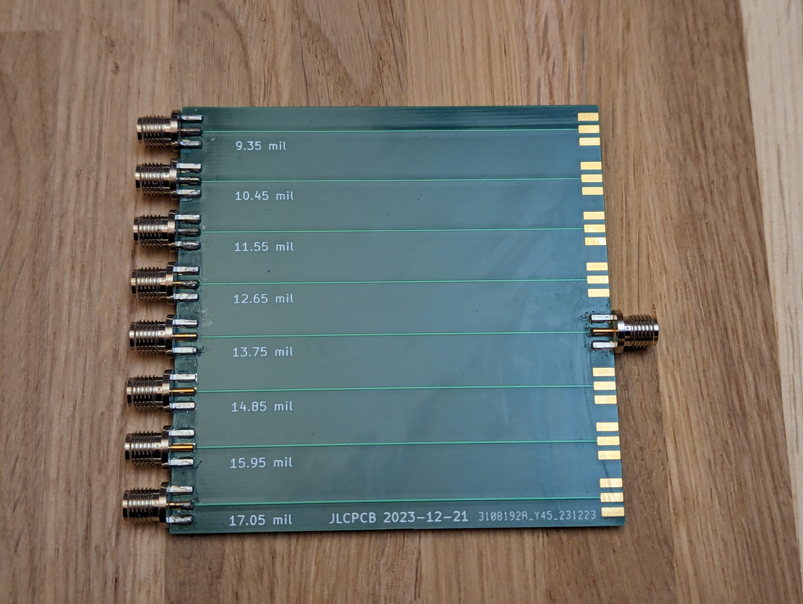
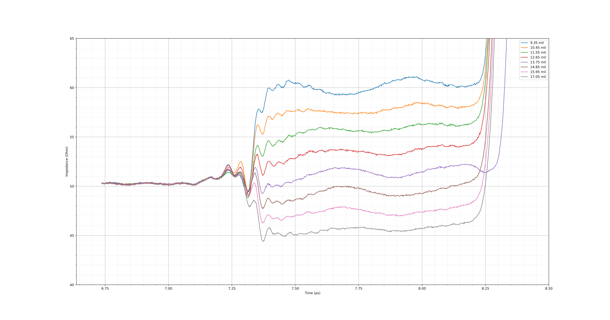
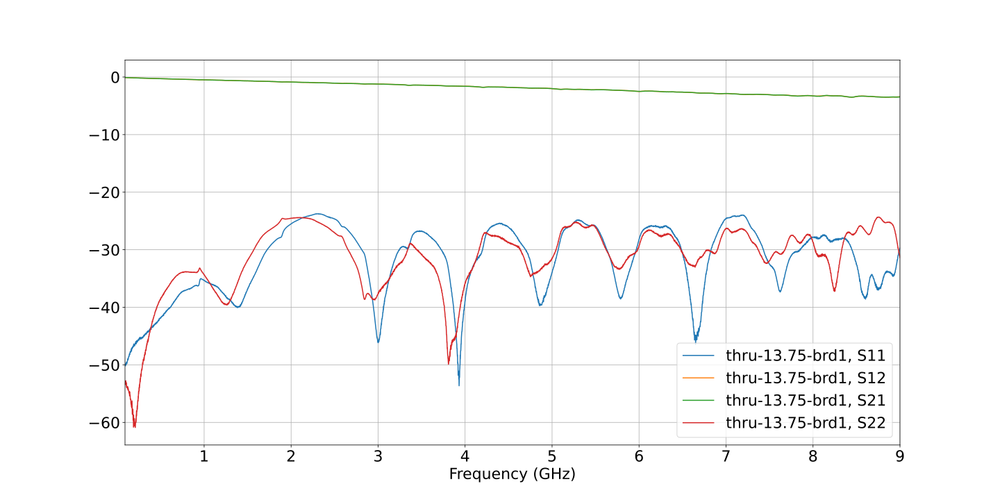

# 2024-01-05 Microstrip trace width test board for JLCPCB 7628 stackup

Recently, JLCPCB published a new impedance calculator that gives different suggested dimensions to what we had tested previously, The purpose of this board is to test out those dimensions and decide on an appropriate trace width for a 50 Ohm microstrip.

The board design files can be found here: https://github.com/greatscottgadgets/misc/tree/cf595509b7f8e9d91273c6eaf7227a8bcffefa0e/evaluation-boards/trace-width

## TDR Results

## S-parameters

## Conclusion

The stackup specifications have definitely changed and the previous trace width of 11.55mil is no longer appropriate. The suggested 13.75mil width is a pretty good match in this test, averaging around 51.5 Ohms in the TDR testing. There may be room for optimisation by picking a width between 13.75 and 14.85mil, but there could be some extra variance between batches. The overall return loss looks good with ~25 dB up to 9 GHz, so the SMA launch footprint is working well.

The results for the 11.55mil wide trace also match up with the [test from last year](https://github.com/greatscottgadgets/lab-notes/tree/main/rf-testing/2023-04-19-sma-jlcpcb-test-board#readme) and explains why we were seeing higher than expected trace impedance.
