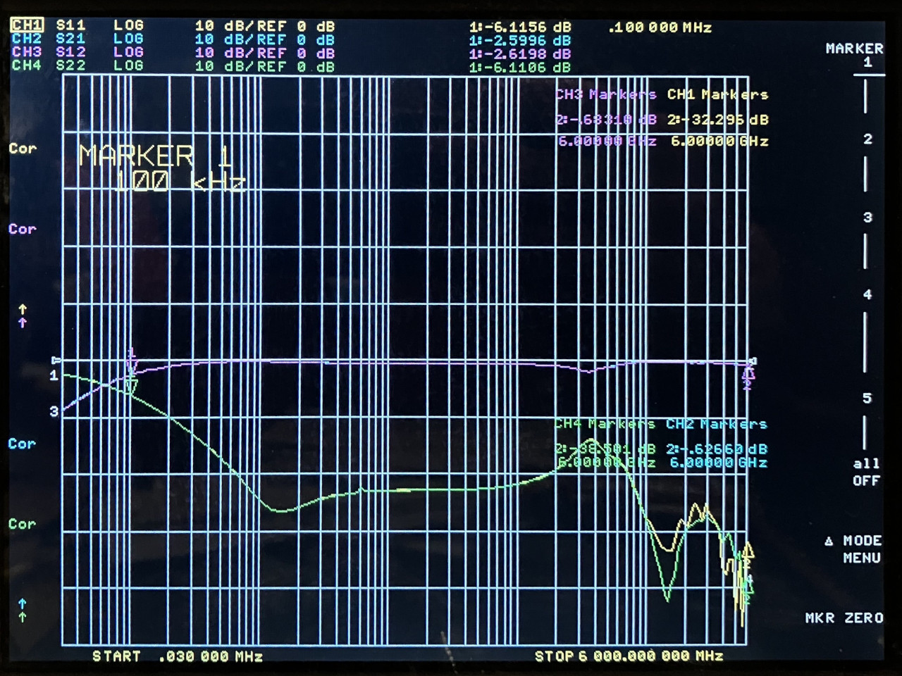

# 2024-11-20 RF Choke Test

## Purpose

Evaluate the performance of RF chokes for URTI.

The URTI mainboard r0.1.0 uses a pair of inductors in series as an RF choke to supply power to the RFFC5072 mixer output. A similar choke will be needed in a bias tee arrangement for amplifiers and other uses.

While the overall wideband performance of mainboard r0.1.0 is very good, there is a dip in TX output power around 700 MHz. We suspect that this dip may be caused by the RF choke.

Chokes were installed on a PCB, design here (commit 1a3f480 used for manufacturing): https://github.com/greatscottgadgets/misc/tree/master/evaluation-boards/passives

## DC Blocking Capacitors

Because DC blocking capacitors are required for the bias tee configuration used to test the RF chokes, I first tested DC blocking capacitors in isolation. I tested them with and without anti-pad cutouts in the inner ground planes.

### GRM033R61A105ME44D 1 μF 0201

<figcaption>

*GRM033R61A105ME44D series*

</figcaption>

<figcaption>

*GRM033R61A105ME44D series with anti-pads*

</figcaption>

### CL05A105KA5NQNC 1 μF 0402

<figcaption>

*CL05A105KA5NQNC series*

</figcaption>

<figcaption>

*CL05A105KA5NQNC series with anti-pads*

</figcaption>

## Single-Inductor RF Chokes

### LQP03TN33NJ02D 33 nH 0201

GRM033R61A105ME44D DC blocks were installed on either side of the shunt inductor. High frequency performance improved with anti-pads.

<figcaption>

*LQP03TN33NJ02D shunt*

</figcaption>

<figcaption>

*LQP03TN33NJ02D shunt with anti-pads*

</figcaption>

### LQP03HQ56NH02D 56 nH 0201

GRM033R61A105ME44D DC blocks were installed on either side of the shunt inductor. High frequency performance improved with anti-pads.

<figcaption>

*LQP03HQ56NH02D shunt*

</figcaption>

<figcaption>

*LQP03HQ56NH02D shunt with anti-pads*

</figcaption>

### LSQNB160808T470K 47 μH 0603

The 0603 inductor was installed on an 0402 footprint. CL05A105KA5NQNC DC blocks were installed on either side of the shunt inductor.

<figcaption>

*LSQNB160808T470K shunt with anti-pads*

</figcaption>

### BRL1608T100M 10 μH 0603

The 0603 inductor was installed on an 0402 footprint. CL05A105KA5NQNC DC blocks were installed on either side of the shunt inductor.

<figcaption>

*BRL1608T100M shunt with anti-pads*

</figcaption>

### BRL1608T150M 15 μH 0603

The 0603 inductor was installed on an 0402 footprint. CL05A105KA5NQNC DC blocks were installed on either side of the shunt inductor.

<figcaption>

*BRL1608T150M shunt with anti-pads*

</figcaption>

## Dual-Inductor RF Chokes

All dual-inductor configurations were tested with anti-pads in the RF path. Except where noted, GRM033R61A105ME44D DC blocks were installed. The inductors were installed in series, shunted to ground or to a 3.3 V supply.

### LQP03TN33NJ02D 33 nH 0201 with LSQNB160808T470K 47 μH 0603

This pair of inductors was used as the RF choke on URTI mainboard r0.1.0.

<figcaption>

*LQP03TN33NJ02D with LSQNB160808T470K shunted to 0 V*

</figcaption>

<figcaption>

*LQP03TN33NJ02D with LSQNB160808T470K shunted to 3.3 V*

</figcaption>

### LQP03HQ56NH02D 56 nH 0201 with LSQNB160808T470K 47 μH 0603

<figcaption>

*LQP03HQ56NH02D with LSQNB160808T470K shunted to 3.3 V*

</figcaption>

I tried to reduce parasitic capacitance by connecting the two inductors in mid-air instead of on PCB pads. This was done with CL05A105KA5NQNC DC blocks.

<figcaption>

*LQP03HQ56NH02D with LSQNB160808T470K 3D sculpture shunted to 0 V*

</figcaption>

### LQP03HQ56NH02D 56 nH 0201 with LSQPA201616T101M 100 μH 0806

The 0806 inductor was installed on an 0603 footprint.

<figcaption>

*LQP03HQ56NH02D with LSQPA201616T101M shunted to 3.3 V*

</figcaption>

### LQP03HQ56NH02D 56 nH 0201 with CBC2016T101M 100 μH 0806

The 0806 inductor was installed on an 0603 footprint.

<figcaption>

*LQP03HQ56NH02D with CBC2016T101M shunted to 3.3 V*

</figcaption>

### LQP03HQ56NH02D 56 nH 0201 with BRL2012T101M 100 μH 0805

The 0805 inductor was installed on an 0603 footprint.

<figcaption>

*LQP03HQ56NH02D with BRL2012T101M shunted to 3.3 V*

</figcaption>

### LQP03HQ56NH02D 56 nH 0201 with LQH2MPN820MGRL 82 μH 0806

The 0806 inductor was installed on an 0603 footprint.

<figcaption>

*LQP03HQ56NH02D with LQH2MPN820MGRL shunted to 3.3 V*

</figcaption>

### LQP03HQ56NH02D 56 nH 0201 with LQH2MCN820K02L 82 μH 0806

The 0806 inductor was installed on an 0603 footprint.

<figcaption>

*LQP03HQ56NH02D with LQH2MCN820K02L shunted to 3.3 V*

</figcaption>

### LQP03HQ56NH02D 56 nH 0201 with BRL2012T680M 68 μH 0805

The 0805 inductor was installed on an 0603 footprint.

<figcaption>

*LQP03HQ56NH02D with BRL2012T680M shunted to 3.3 V*

</figcaption>

### LQP03HQ56NH02D 56 nH 0201 with BRC2016T680K 68 μH 0806

The 0806 inductor was installed on an 0603 footprint.

<figcaption>

*LQP03HQ56NH02D with BRC2016T680K shunted to 3.3 V*

</figcaption>

### LQP03HQ56NH02D 56 nH 0201 with LSQPB201210T680M 68 μH 0805

The 0805 inductor was installed on an 0603 footprint.

<figcaption>

*LQP03HQ56NH02D with LSQPB201210T680M shunted to 3.3 V*

</figcaption>

### LQP03HQ56NH02D 56 nH 0201 with LSQMB201616T680J 68 μH 0806

The 0806 inductor was installed on an 0603 footprint.

<figcaption>

*LQP03HQ56NH02D with LSQMB201616T680J shunted to 3.3 V*

</figcaption>

### LQP03HQ56NH02D 56 nH 0201 with LBM2016T680J 68 μH 0806

The 0806 inductor was installed on an 0603 footprint.

<figcaption>

*LQP03HQ56NH02D with LBM2016T680J shunted to 3.3 V*

</figcaption>

## Triple-Inductor RF Choke

### LQP03HQ56NH02D 56 nH 0201 with LQP03HQR47H02D 470 nH 0201 and LSQNB160808T470K 47 μH 0603

The 470 nH and 47 μH inductors were bodged in mid-air.

<figcaption>

*LQP03HQ56NH02D with LQP03HQR47H02D and LSQNB160808T470K shunted to 3.3 V*

</figcaption>

## Dual-Inductor RF Chokes with de-Q

### LQP03HQ56NH02D 56 nH 0201 with LSQNB160808T470K 47 μH 0603

In an effort to reduce resonance near 700 MHz, I installed a 330 ohm resistor in series with a 330 pF capacitor. This pair of components formed a shunt to ground between the two inductors.

<figcaption>

*LQP03HQ56NH02D/LSQNB160808T470K shunted to 3.3 V with 330 ohm, 330 pF de-Q*

</figcaption>

### LQP03HQ56NH02D 56 nH 0201 with BRL2012T101M 100 μH 0805

The 0805 inductor was installed on an 0603 footprint.

<figcaption>

*LQP03HQ56NH02D/BRL2012T101M shunted to 3.3 V with 330 ohm, 330 pF de-Q*

</figcaption>

<figcaption>

*LQP03HQ56NH02D/BRL2012T101M shunted to 3.3 V with 120 ohm, 330 pF de-Q*

</figcaption>

<figcaption>

*LQP03HQ56NH02D/BRL2012T101M shunted to 3.3 V with 120 ohm, 100 pF de-Q*

</figcaption>

## Conclusions

The RF choke was indeed the cause of the 700 MHz dip in URTI mainboard r0.1.0 performance.

It was helpful to de-Q a dual-inductor choke with a resistor and capacitor. Reducing parasitic capacitance between the inductors also helped. An updated layout with a ground plane cut-out and footprints for de-Q components would be helpful for further experimentation.

BRL1608T150M performed very well as a single-inductor wideband choke.

Both DC blocking capacitors performed well for the intended test range of 100 kHz to 6 GHz. Anti-pads improved the high frequency performance of the 0402 CL05A105KA5NQNC. Anti-pads very slightly degraded high frequency performance of the 0201 GRM033R61A105ME44D. This result is unsurprising because the 50 ohm trace width is very close to the 0201 pad width.

