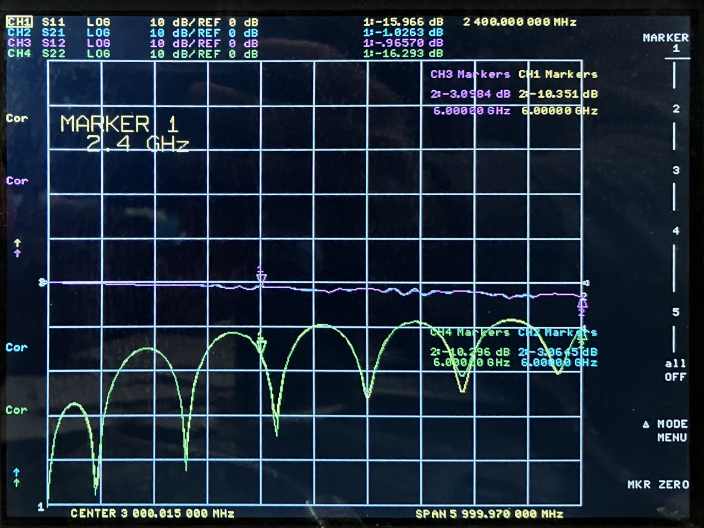

# 2024-11-22 SMA Connector Footprint Test

## Purpose

Evaluate the performance of low-cost 11 mm end-launch SMA connectors with various footprints. The two connectors have similar geometry including 1 mm center pin diameter.

The PCBs were manufactured by JLCPCB. The design is here (commit e2765bd used for manufacturing): https://github.com/greatscottgadgets/misc/blob/master/evaluation-boards/trace-width/sma-jlcpcb.kicad_pro

## BWSMA-KE11

[data sheet](https://www.lcsc.com/datasheet/lcsc_datasheet_2409272203_BAT-WIRELESS-BWSMA-KE11_C5250058.pdf)

### BWSMA-KE11 on HackRF One footprint 

The footprint was copied from HackRF One r10.

<figcaption>

*BWSMA-KE11 on HackRF One r10 footprint*

</figcaption>

### BWSMA-KE11 on new footprint

<figcaption>

*BWSMA-KE11 on new footprint with 1.3 mm keepout*

</figcaption>

<figcaption>

*BWSMA-KE11 on new footprint with 2.0 mm keepout*

</figcaption>

<figcaption>

*BWSMA-KE11 on new footprint with 2.7 mm keepout*

</figcaption>

<figcaption>

*BWSMA-KE11 on new footprint with 3.4 mm keepout*

</figcaption>

### BWSMA-KE11 on Linx SMA_CONSMA003.062 footprint

<figcaption>

*BWSMA-KE11 on SMA_CONSMA003.062 footprint*

</figcaption>

## A-SMA-KE-16.5A

[data sheet](https://www.lcsc.com/datasheet/lcsc_datasheet_2406251601_MyAntenna-A-SMA-KE-16-5A_C22467617.pdf)

### A-SMA-KE-16.5A on HackRF One footprint 

The footprint was copied from HackRF One r10.

<figcaption>

*A-SMA-KE-16.5A on HackRF One r10 footprint*

### A-SMA-KE-16.5A on Linx SMA_CONSMA003.062 footprint

<figcaption>

*A-SMA-KE-16.5A on SMA_CONSMA003.062 footprint*

</figcaption>

### A-SMA-KE-16.5A on new footprint

<figcaption>

*A-SMA-KE-16.5A on new footprint with 2.7 mm keepout*

</figcaption>

## Conclusions

Both connectors performed reasonably well with the HackRF One footprint, the Linx footprint, and the new footprint with 2.7 mm wide internal keepout. It may be possible to improve the new footprint by trying other keepout widths between 2 and 3 mm.
