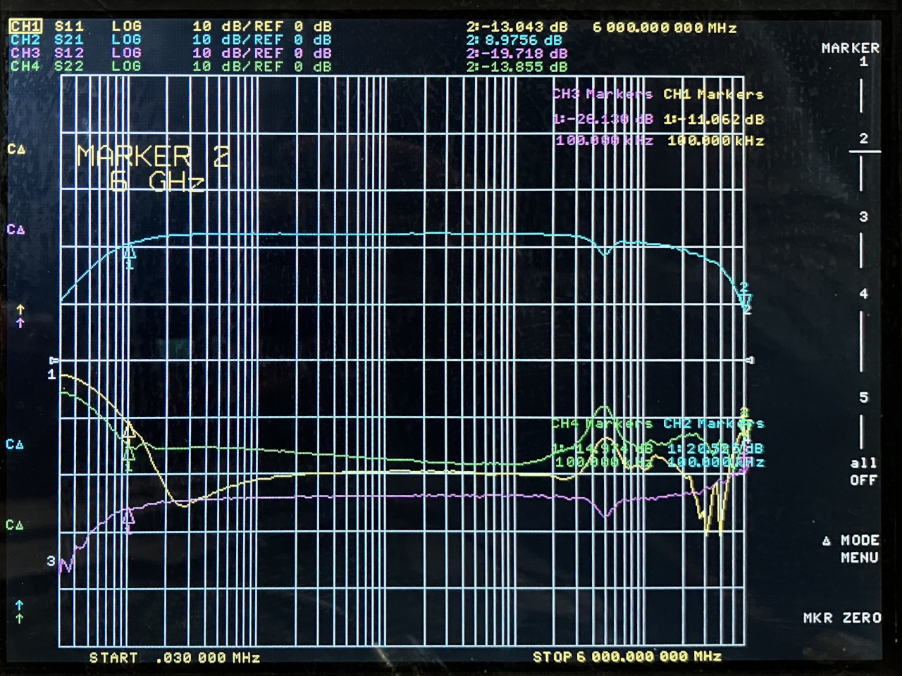

# 2024-11-27 RF Amplifier Test

## Purpose

Evaluate the performance of RF amplifier ICs for low-power, wideband applications.

1 uF 0201 capacitors were used for all DC blocks and decoupling.  RF chokes consisted of BRL2012T101M (100 uH) in series with LQP03TN33NJ02D (33 nH) or LQP03HQ56NH02D (56 nH) inductors.  This arrangement results in a defect in the vicinity of 400 or 500 MHz but otherwise [performs very well](../2024-11-20-choke-test#lqp03hq56nh02d-56-nh-0201-with-brl2012t101m-100-%CE%BCh-0805) from below 100 kHz to 6 GHz.

Test PCBs were manufactured by JLCPCB. The design is here (commit d32d287 used for manufacturing): https://github.com/greatscottgadgets/misc/blob/master/evaluation-boards/rf-amps/

## BGA2817

[data sheet](https://www.nxp.com/docs/en/data-sheet/BGA2817.pdf)

### BGA2817 at 3.3 V

<figcaption>

*BGA2817 with 3.3 V supply*

</figcaption>

### BGA2817 at 3.0 V

<figcaption>

*BGA2817 with 3.0 V supply*

</figcaption>

## BGB741L7ESD

[data sheet](https://www.infineon.com/dgdl/Infineon-BGB741L7ESD-DataSheet-v03_01-EN.pdf?fileId=5546d46265f064ff016638972c994ed7)

### BGB741L7ESD at 3.3 V with 3k resistor

<figcaption>

*BGB741L7ESD with 3.3 V supply and 3k resistor*

</figcaption>

### BGB741L7ESD at 1.8 V with 3k resistor

<figcaption>

*BGB741L7ESD with 1.8 V supply and 3k resistor*

</figcaption>

### BGB741L7ESD at 3.3 V with 30k resistor

<figcaption>

*BGB741L7ESD with 3.3 V supply and 30k resistor*

</figcaption>

### BGB741L7ESD at 1.8 V with 30k resistor

<figcaption>

*BGB741L7ESD with 1.8 V supply and 30k resistor*

</figcaption>

### BGB741L7ESD at 3.3 V with 330 ohm resistor

<figcaption>

*BGB741L7ESD with 3.3 V supply and 330 ohm resistor*

</figcaption>

### BGB741L7ESD at 1.8 V with 330 ohm resistor

<figcaption>

*BGB741L7ESD with 1.8 V supply and 330 ohm resistor*

</figcaption>

## TQP3M9037

[data sheet](https://www.qorvo.com/products/d/da005549)

### TQP3M9037 at 3.3 V

<figcaption>

*TQP3M9037 with 3.3 V supply*

</figcaption>

## TRF37B73

[data sheet](https://www.ti.com/lit/ds/symlink/trf37b73.pdf)

### TRF37B73 at 3.3 V

<figcaption>

*TRF37B73 with 3.3 V supply*

</figcaption>

## TRF37D73

[data sheet](https://www.ti.com/lit/ds/symlink/trf37d73.pdf)

### TRF37D73 at 3.3 V

<figcaption>

*TRF37D73 with 3.3 V supply*

</figcaption>

## TQP369184

[data sheet](https://www.qorvo.com/products/d/da005471)

An error in a distributor's catalog led me to believe that this part would operate with a 3.3 V supply.  The data sheet does not indicate that it is meant to operate below 5 V.  Upon testing I found that it is inoperative below 4 V.

## GRF2013

[data sheet](https://www.guerrilla-rf.com/products/DataSheet?sku=2013&file_name=GRF2013DS.pdf)

### GRF2013 at 3.3 V with 820 ohm resistor

<figcaption>

*GRF2013 with 3.3 V supply and 820 ohm resistor*

</figcaption>

### GRF2013 at 3.3 V with 200 ohm resistor

<figcaption>

*GRF2013 with 3.3 V supply and 200 ohm resistor*

</figcaption>

### GRF2013 at 3.3 V with 820 ohm resistor and tuning capacitors

I installed a 0.2 pF shunt capacitor on the input and a 0.5 pF shunt capacitor on the output for tuning.

<figcaption>

*GRF2013 with 3.3 V supply, 820 ohm resistor and tuning capacitors*

</figcaption>

## GRF4002

[data sheet](https://www.guerrilla-rf.com/products/DataSheet?sku=4002&file_name=GRF4002DS.pdf)

### GRF4002 at 3.3 V with 3k resistor

<figcaption>

*GRF4002 with 3.3 V supply and 3k resistor*

</figcaption>

### GRF4002 with bidirectional switch

I installed a GRF4002 between two SPDT switches, testing a two-switch arrangement to achieve TX/RX switching with a single amplifier providing gain in both directions. Bypass mode was implemented by powering off the amplifier and connecting both ports to the amplifier's input.

<figcaption>

*switched GRF4002, forward direction*

</figcaption>

<figcaption>

*switched GRF4002, reverse direction*

</figcaption>

<figcaption>

*switched GRF4002, bypassed*

</figcaption>

## Conclusions

In general, the amplifiers had reasonable gain well below their advertised operating frequency range, but in most cases they also exhibied high impedance at very low frequencies.

The TRF37 family performed best overall. BGA2817 had the flattest response from 30 kHz to 3 GHz.

The two-switch bidirectional arrangement performed poorly above 300 MHz. A four-switch arrangement or a pair of amplifiers with two switches should be preferred for wideband operation.
