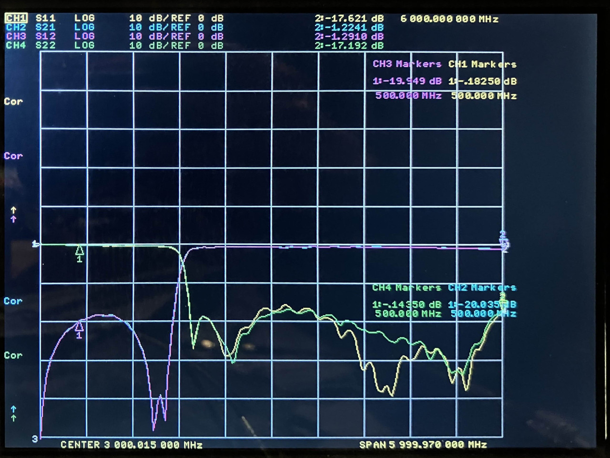

# 2024-12-16 Filter Test

## Purpose

Evaluate the performance of RF filters.

The PCBs were manufactured by JLCPCB. The design is here (commit c479850 used for manufacturing): https://github.com/greatscottgadgets/misc/tree/master/evaluation-boards/filters

## DEA162400HT-8053A1

[data sheet](https://product.tdk.com/system/files/dam/doc/product/rf/rf/filter/catalog/rf_hpf_dea162400ht-8053a1_en.pdf)

The part was installed on a footprint designed for DEA162400HT-8004B1.

<figcaption>

*DEA162400HT-8053A1*

</figcaption>

## DEA162400HT-8004B1

[data sheet](https://product.tdk.com/en/system/files?file=dam/doc/product/rf/rf/filter/catalog/rf_hpf_dea162400ht-8004b1_en.pdf)

<figcaption>

*DEA162400HT-8004B1*

</figcaption>

## TSH1N18D2G49LS0FBT

[data sheet](https://ds.yuden.co.jp/TYCOMPAS/ap/detail?pn=TSH1N18D2G49LS0FBT)

The part was installed on a footprint designed for DEA162400HT-8004B1.

<figcaption>

*TSH1N18D2G49LS0FBT*

</figcaption>

## DEA162300HT-8047A1

[data sheet](https://mm.digikey.com/Volume0/opasdata/d220001/medias/docus/2176/DEA162300HT-8047A1_Rev1_0.pdf)

The part was installed on a footprint designed for DEA162400HT-8004B1.

<figcaption>

*DEA162300HT-8047A1*

</figcaption>

## DEA202400HT-8037A1

[data sheet](https://mm.digikey.com/Volume0/opasdata/d220001/medias/docus/2255/DEA202400HT-8037A1_Rev2_0_a.pdf)

The part was installed on a footprint designed for DEA162400HT-8004B1.

<figcaption>

*DEA202400HT-8037A1*

</figcaption>

## 5130BP18U4060001E

[data sheet](https://www.johansontechnology.com/datasheets/5130BP18U4060/5130BP18U4060.pdf)

<figcaption>

*5130BP18U4060001E*

</figcaption>

## Lumped Element High-Pass Filter

1 pF, 2 nH, 0.6 pF, 2 nH, 1 pF

<figcaption>

*lumped element HPF*

</figcaption>

## Lumped Element Low-Pass Filter

1.8 pF, 5.6 nH, 2.7 pF, 5.6 nH, 1.8 pF

<figcaption>

*lumped element LPF*

</figcaption>
