# 2024-12-16 SPDT RF Switch Test

## Purpose

Evaluate the performance of SPDT RF switches.

The PCBs were manufactured by JLCPCB. The design is here (commit 7b1c7f8 used for manufacturing): https://github.com/greatscottgadgets/misc/tree/master/evaluation-boards/rf-switch-spdt

DC blocking capacitors were populated with Samsung CL05A105KA5NQNC. Decoupling capacitors were 330 pF. I tested only one pair of ports on each switch. Unused ports were left unconnected. I applied 3.3 V power and control signals.

Components were selected in part from: [rf-switches-2023-04-09](../../component-notes/rf-switches-2023-04-09.md)

## BGS12P2L6E6327XTSA1

[data sheet](https://www.infineon.com/dgdl/Infineon-BGS12P2L6-DataSheet-v02_00-EN.pdf?fileId=5546d4626cb27db2016d4487d53603ce)

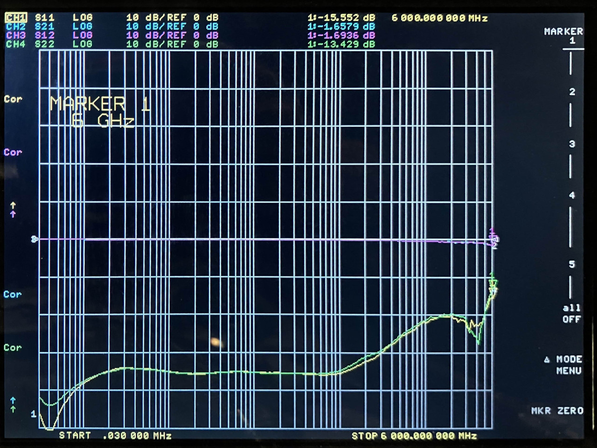
<figcaption>

*BGS12P2L6E6327XTSA1 insertion loss*

</figcaption>

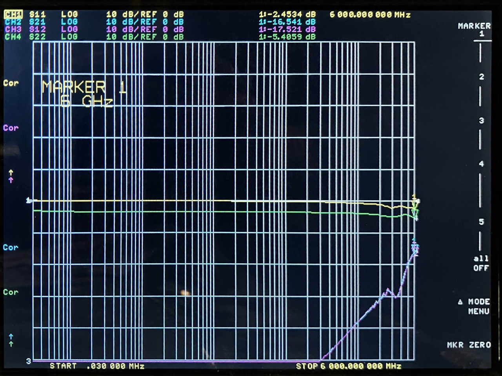
<figcaption>

*BGS12P2L6E6327XTSA1 isolation*

</figcaption>

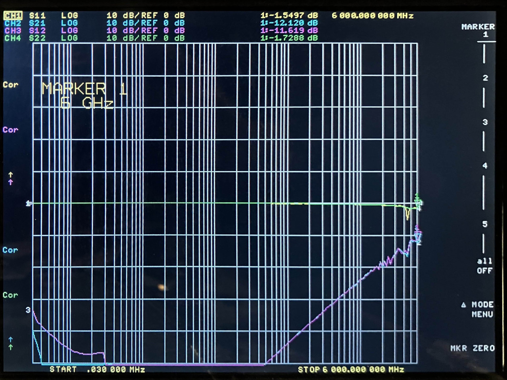
<figcaption>

*BGS12P2L6E6327XTSA1 unpowered*

</figcaption>

## MXD8721

[data sheet](https://www.lcsc.com/datasheet/lcsc_datasheet_1912240933_Maxscend-MXD8721_C285582.pdf)

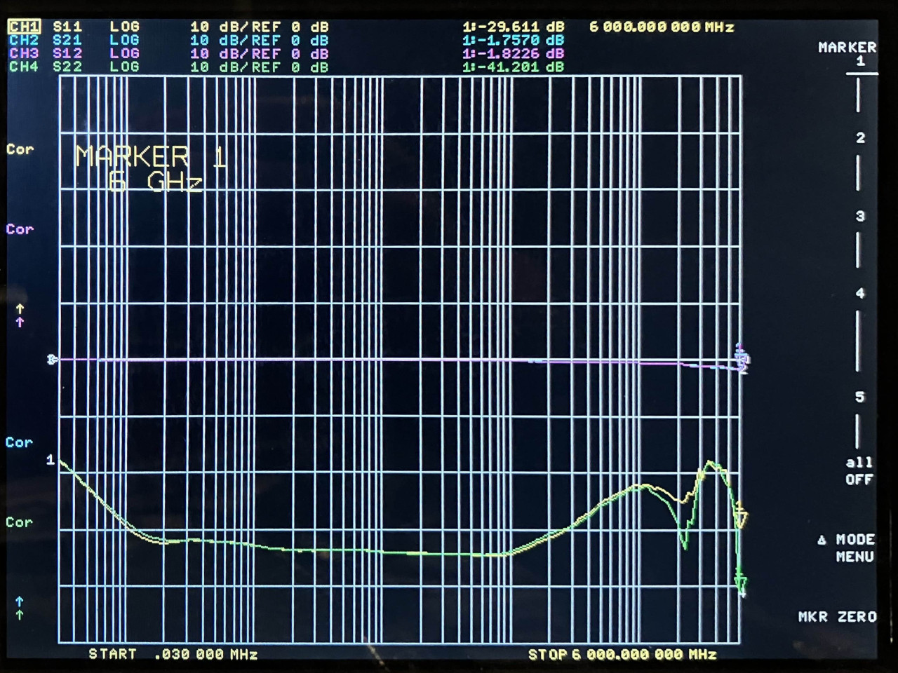
<figcaption>

*MXD8721 insertion loss*

</figcaption>

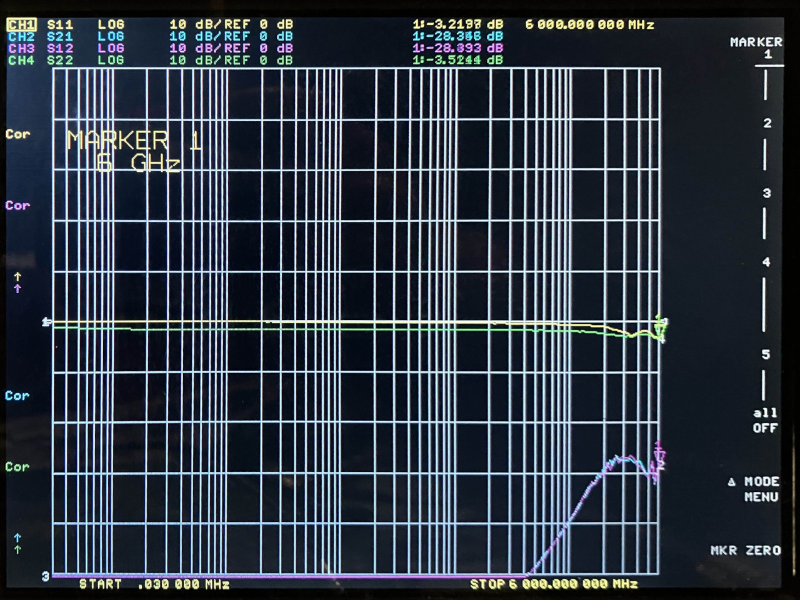
<figcaption>

*MXD8721 isolation*

</figcaption>

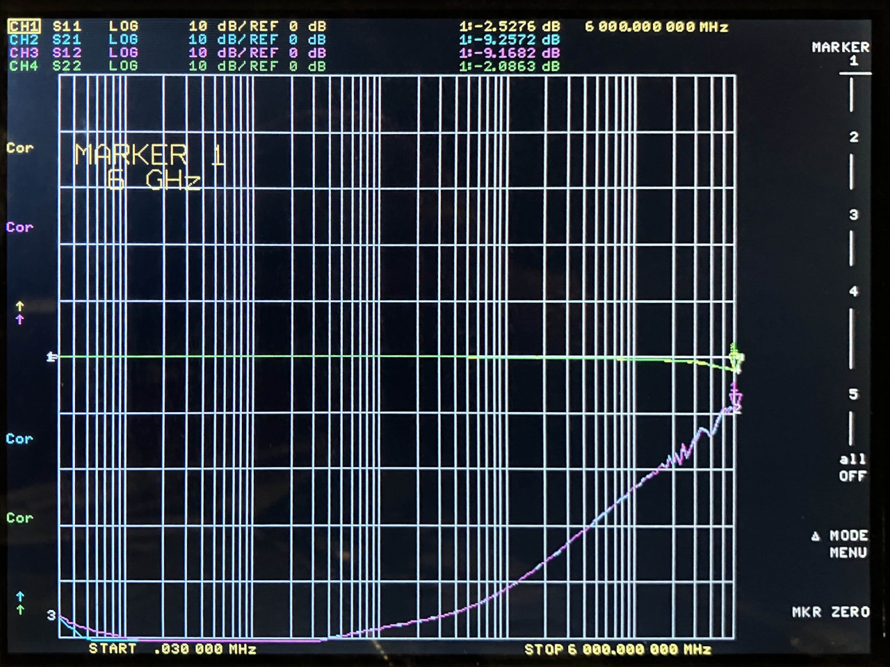
<figcaption>

*MXD8721 unpowered*

</figcaption>

## FM8625H

[data sheet](https://wmsc.lcsc.com/wmsc/upload/file/pdf/v2/lcsc/2109141830_Shenzhen-Fuman-Elec-FM8625H_C2857391.pdf)

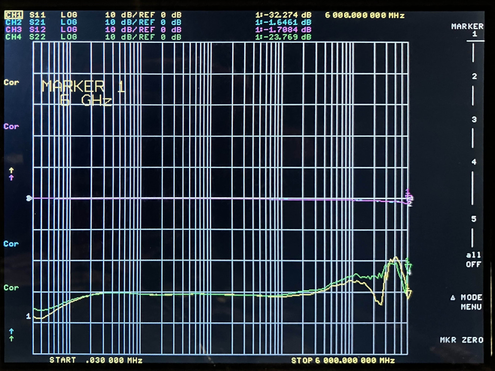
<figcaption>

*FM8625H insertion loss*

</figcaption>

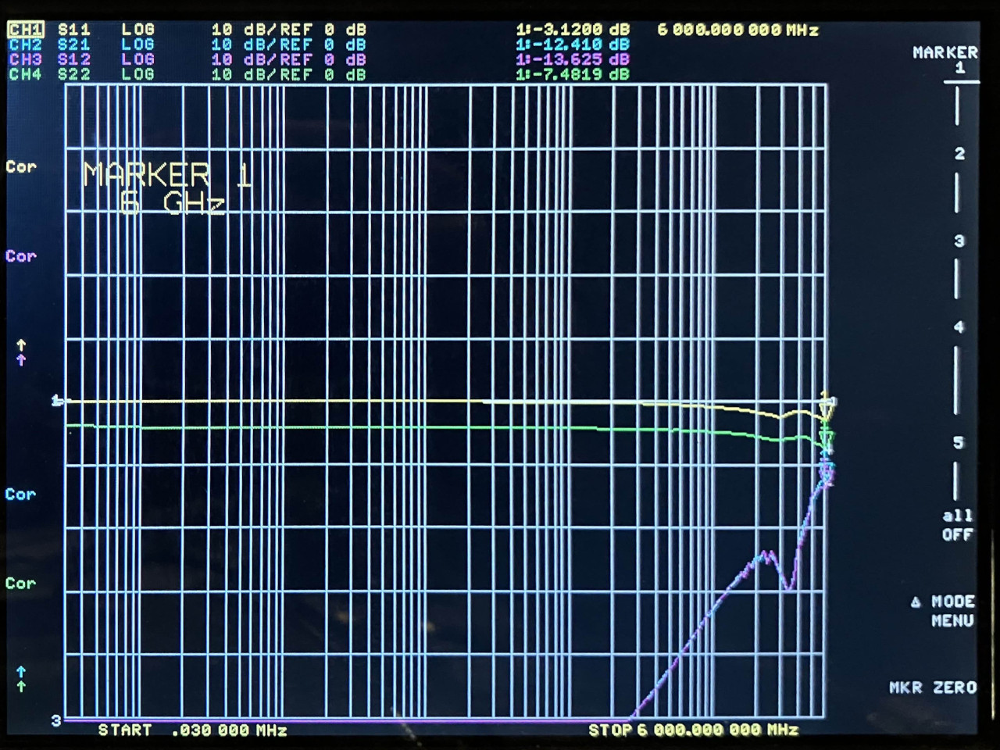
<figcaption>

*FM8625H isolation*

</figcaption>

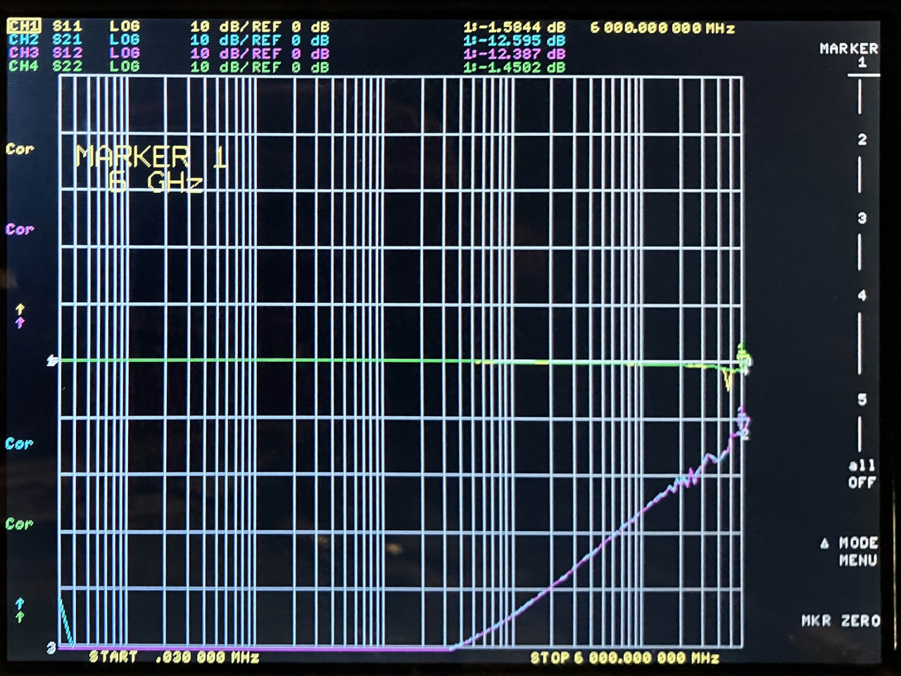
<figcaption>

*FM8625H unpowered*

</figcaption>

## WS7872DE-6/TR

[data sheet](https://wmsc.lcsc.com/wmsc/upload/file/pdf/v2/lcsc/2201121830_WILLSEMI-Will-Semicon-WS7872DE-6-TR_C2939864.pdf)

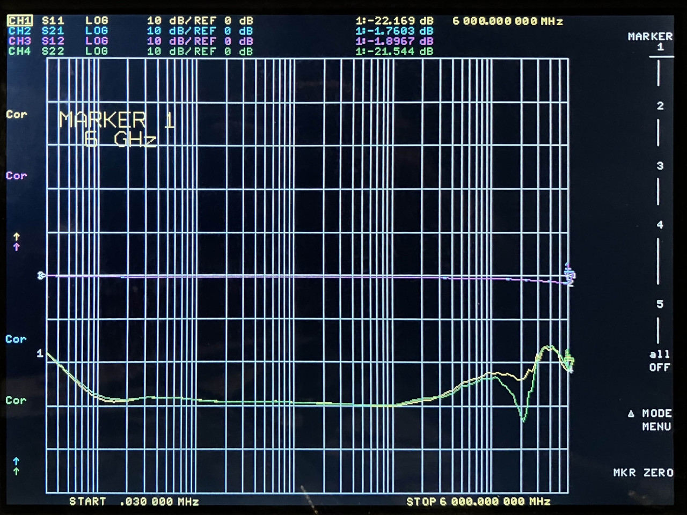
<figcaption>

*WS7872DE-6/TR insertion loss*

</figcaption>

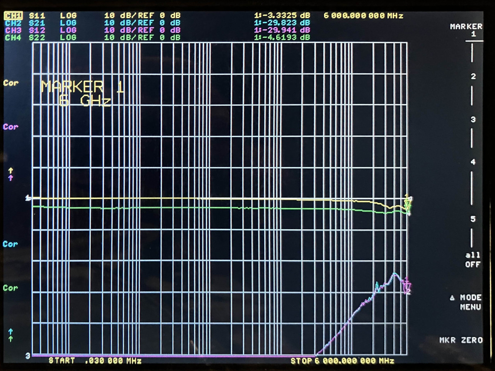
<figcaption>

*WS7872DE-6/TR isolation*

</figcaption>

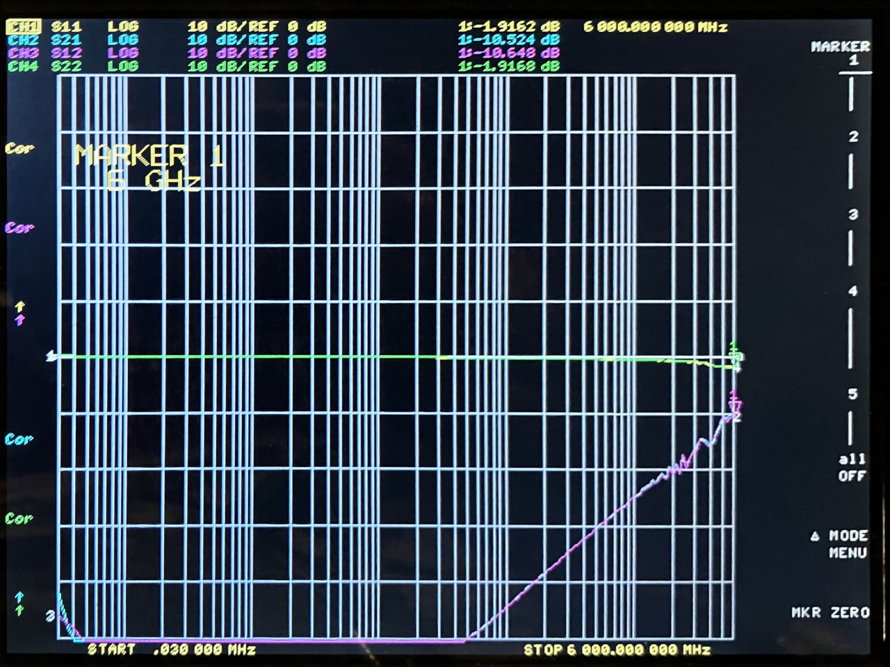
<figcaption>

*WS7872DE-6/TR unpowered*

</figcaption>

## Conclusion

All four switches performed very well overall. MXD8721 and WS7872DE-6/TR had better isolation at high frequencies.
