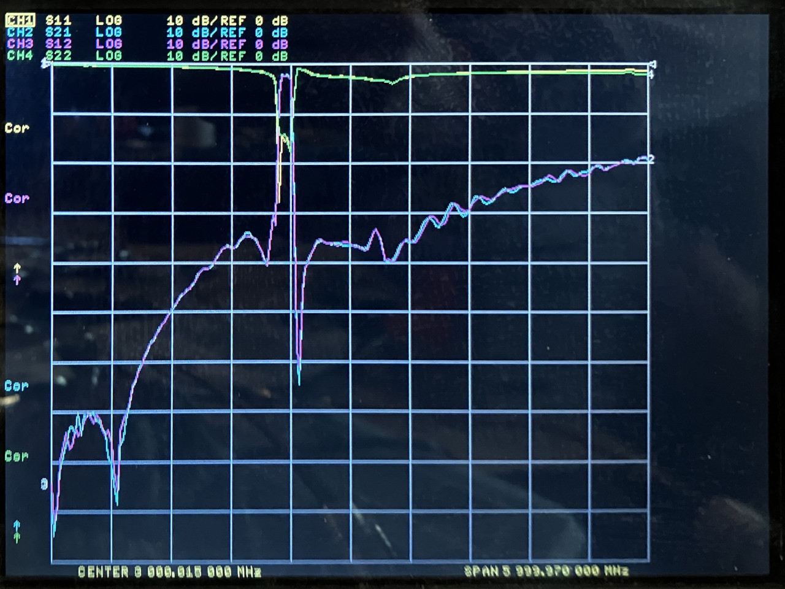
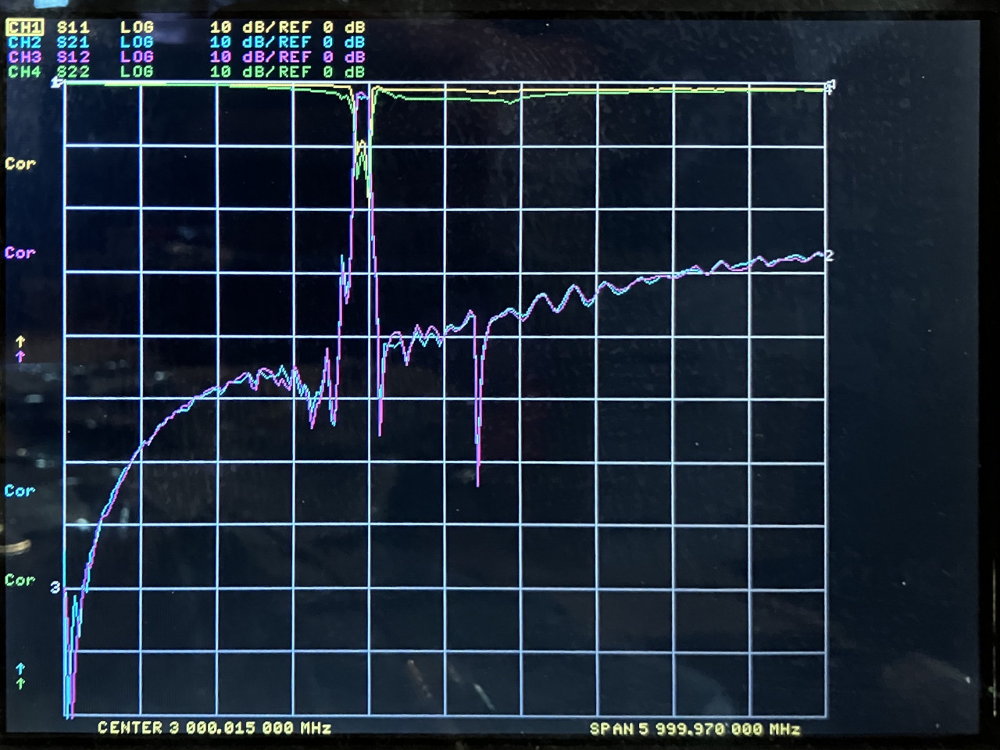
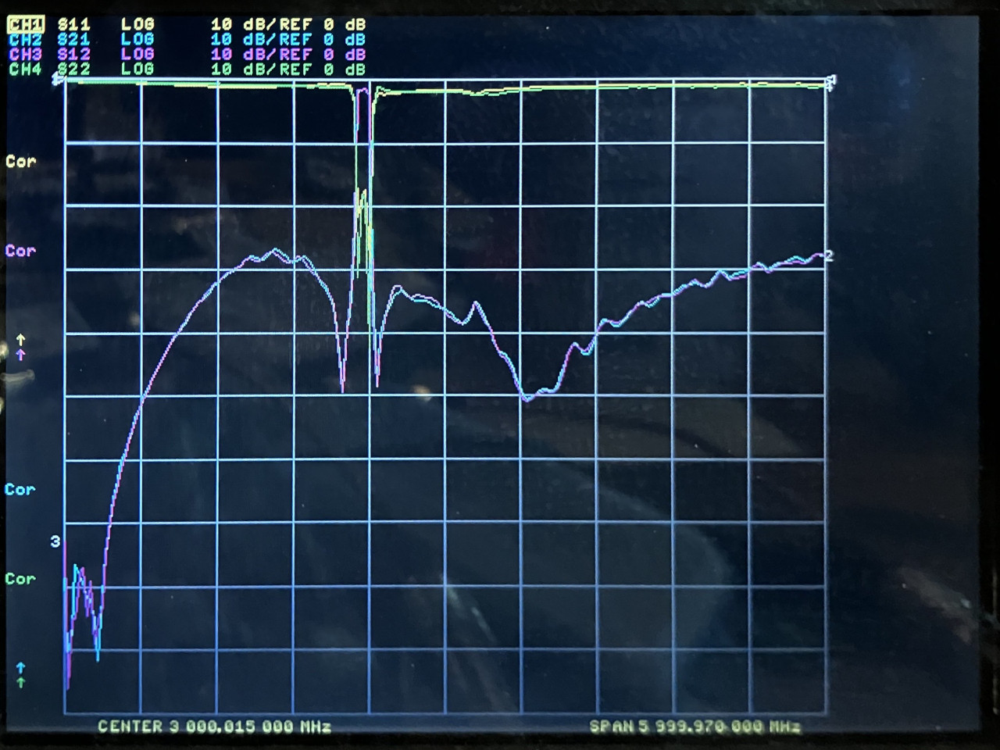
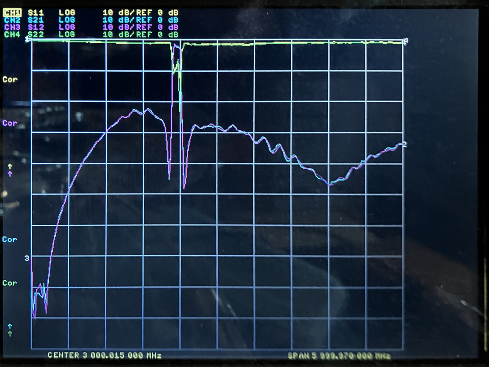
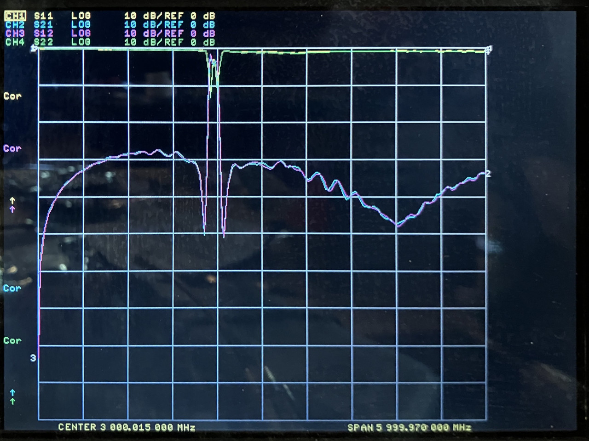

# 2025-03-23 Filter Test

## Purpose

Evaluate the performance of SAW filters for 2.3 to 2.4 GHz.

The PCBs were manufactured by JLCPCB. The design is here (commit f9433c1 used for manufacturing): https://github.com/greatscottgadgets/misc/tree/master/evaluation-boards/filters

## SA4011092G35AT

[data sheet](https://www.lcsc.com/datasheet/lcsc_datasheet_2410121332_Sunltech-Tech-SA4011092G35AT_C5279991.pdf)

Two 3.0 nH inductors were installed as recommended by the data sheet.

<figcaption>

*SA4011092G35AT*

</figcaption>

## SAFFB2G35AA0F0AR1X

[data sheet](https://www.murata.com/en-us/products/productdata/8797684727838/DS-SAFFB2G35AA0F0A.pdf)

One 3.0 nH inductor was installed as recommended by the data sheet.

<figcaption>

*SAFFB2G35AA0F0AR1X*

</figcaption>

## KH-SAWF235A

[data sheet](http://www.kinghelm.net/Data/bds666/upload/file/20240319/KH-SAWF235A.pdf)

Two 5.6 nH inductors were installed as recommended by the data sheet.

<figcaption>

*KH-SAWF235A*

</figcaption>

## SF11092350B4005T

[data sheet](https://www.lcsc.com/datasheet/lcsc_datasheet_2410121648_Walsin-Tech-Corp-SF11092350B4005T_C474018.pdf)

Two 5.6 nH inductors were installed and then removed.

<figcaption>

*SF11092350B4005T with 5.6 nH*

</figcaption>

<figcaption>

*SF11092350B4005T without tuning inductors*

</figcaption>

## Conclusions

All four SAW filters are bidirectional.

The SF11092350B4005T data sheet lacked a tuning recommendation, but the test results suggest that tuning could be helpful.
